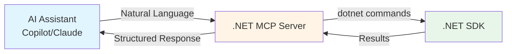
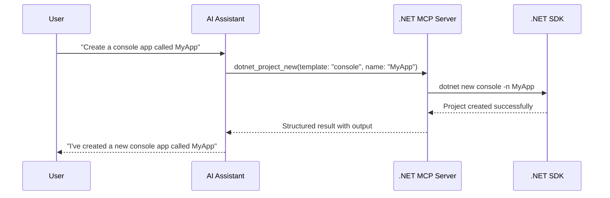

# .NET MCP Server

<!-- mcp-name: io.github.jongalloway/dotnet-mcp -->

[](https://github.com/jongalloway/dotnet-mcp/actions/workflows/build.yml)
[](https://github.com/jongalloway/dotnet-mcp/blob/main/.github/dependabot.yml)
[](https://www.nuget.org/packages/Community.Mcp.DotNet/)

Give your AI assistant superpowers for .NET development! This MCP server connects GitHub Copilot, Claude, and other AI assistants directly to the .NET SDK, enabling them to create projects, manage packages, run builds, and more—all through natural language.

## Quick Install

Click to install in your preferred environment:

[](https://vscode.dev/redirect/mcp/install?name=dotnet-mcp&config=%7B%22type%22%3A%22stdio%22%2C%22command%22%3A%22dnx%22%2C%22args%22%3A%5B%22Community.Mcp.DotNet%400.1.0-%2A%22%2C%22--yes%22%5D%7D)
[](https://insiders.vscode.dev/redirect/mcp/install?name=dotnet-mcp&config=%7B%22type%22%3A%22stdio%22%2C%22command%22%3A%22dnx%22%2C%22args%22%3A%5B%22Community.Mcp.DotNet%400.1.0-%2A%22%2C%22--yes%22%5D%7D&quality=insiders)
[](https://vs-open.link/mcp-install?%7B%22name%22%3A%22Community.Mcp.DotNet%22%2C%22type%22%3A%22stdio%22%2C%22command%22%3A%22dnx%22%2C%22args%22%3A%5B%22Community.Mcp.DotNet%400.1.0-%22%2C%22--yes%22%5D%7D)

> **Note**: Quick install requires .NET 10 SDK.

## What is This?

The .NET MCP Server is a bridge that connects AI assistants to the .NET SDK using the [Model Context Protocol](https://modelcontextprotocol.io/). Think of it as giving your AI assistant a direct line to `dotnet` commands, but with intelligence and context.



## Why Use It?

### 🚀 **Faster Development**

Instead of remembering exact `dotnet` commands and syntax, just ask:

- *"Create a new web API project with Entity Framework"*
- *"Add the Serilog package and configure structured logging"*
- *"Update all my NuGet packages to the latest versions"*

### 🧠 **Smarter AI Assistance**

Your AI assistant gets direct access to:

- All installed .NET templates and their parameters
- NuGet package search and metadata
- Framework version information (including LTS status)
- Your solution and project structure

### 🎯 **Why Not Just Let the AI Call `dotnet` Directly?**

The .NET MCP Server provides **context and intelligence** that raw CLI execution cannot:

#### **1. Template Discovery & Validation**

- **With MCP**: AI knows exactly which templates are installed (`console`, `webapi`, `blazor`, etc.) and their parameters
- **Without MCP**: AI guesses template names and parameters, often getting them wrong

#### **2. Framework Intelligence**

- **With MCP**: AI knows which .NET versions are installed, which are LTS, and can recommend appropriately
- **Without MCP**: AI suggests `net8.0` when you only have `net10.0` installed, leading to errors

#### **3. Rich Tool Descriptions**

- **With MCP**: Each tool has detailed parameter descriptions and constraints (e.g., "configuration must be Debug or Release")
- **Without MCP**: AI constructs commands from general knowledge, missing version-specific changes

#### **4. Parameter Information**

- **With MCP**: AI sees template parameters like `--use-controllers`, `--auth`, framework options
- **Without MCP**: AI doesn't know what optional parameters exist for each template

#### **5. Package Search Integration**

- **With MCP**: AI can search NuGet.org to find exact package names and versions
- **Without MCP**: AI guesses package names, often suggesting outdated or incorrect ones

#### **6. Structured Error Handling**

- **With MCP**: Errors are parsed and returned in structured format the AI can understand
- **Without MCP**: AI gets raw stderr output and may misinterpret errors

#### **7. MCP Resources**

MCP Resources provide read-only access to structured metadata about your .NET environment:

- **dotnet://sdk-info** - Information about installed .NET SDKs (versions and paths)
- **dotnet://runtime-info** - Information about installed .NET runtimes (versions and types)
- **dotnet://templates** - Complete catalog of installed .NET templates with metadata
- **dotnet://frameworks** - Information about supported .NET frameworks (TFMs) including LTS status

This enables AI assistants to:

- Answer questions without executing commands ("What .NET versions do I have installed?")
- Provide context-aware suggestions based on your actual environment
- Access structured JSON data more efficiently than parsing CLI output
- Reference official .NET metadata for accurate recommendations

**Example**: Using resources for context-aware assistance

```text
❌ Without Resources:
User: "What .NET versions do I have?"
AI: Executes dotnet --list-sdks and parses output
User: "Which is LTS?"
AI: Executes dotnet --info and tries to parse support info

✅ With Resources:
User: "What .NET versions do I have?"
AI: Reads dotnet://sdk/list resource (no execution needed)
    Returns: .NET 8.0 (LTS), .NET 9.0 (STS), .NET 10.0 (LTS)
User: "Which is LTS?"
AI: Already knows from resource metadata - .NET 8.0, .NET 10.0
```

**Example**: Creating a Blazor project with authentication

```text
❌ Without MCP:
AI: "I'll run: dotnet new blazor --auth Individual"
Result: Error - template 'blazor' doesn't support --auth parameter

✅ With MCP:
AI: Queries dotnet_template_info for 'blazor'
    Sees available parameters: --interactivity, --use-program-main, --empty
    Uses dotnet_template_search to find authentication templates
AI: "I'll create a Blazor Web App with authentication using the correct template..."
Result: Success - uses 'blazor' template with proper authentication configuration
```

### ✨ **Consistent Results**

The MCP server uses official .NET SDK APIs and CLI commands, ensuring:

- Accurate template information from the Template Engine
- Reliable command execution
- Proper error handling and validation

### 🔒 **Secure by Design**

- Runs locally on your machine
- No data sent to external servers
- You control what commands execute
- Standard .NET security model applies
- **Automatic secret redaction** to protect sensitive information in CLI output
  - Connection strings, passwords, and API keys are automatically redacted
  - Implemented using optimized regular expressions with <1% performance overhead
  - References Microsoft.Extensions.Compliance.Redaction for future integration
  - Opt-out available with `unsafeOutput=true` for advanced debugging
  - Patterns include: database credentials, cloud provider keys, tokens, certificates, and more
  - Performance impact is minimal and tested to complete within 500ms for 10,000 lines

## How It Works



The .NET MCP Server acts as an intelligent middleware that:

1. **Translates** natural language requests into structured .NET SDK operations
2. **Validates** parameters using official SDK metadata (templates, frameworks, packages)
3. **Executes** commands safely with proper error handling
4. **Returns** structured results that AI assistants can understand and explain

## Installation

### Requirements

- **For Quick Install**: .NET 10 SDK
- **For Manual Install**: .NET 10 SDK
- Visual Studio Code, Visual Studio 2022 (v17.13+), or Claude Desktop

### Option 1: Quick Install (Recommended)

Use the install badges at the top of this page to automatically configure the MCP server in your environment. The server will be downloaded from NuGet.org on first use.

### Option 2: Manual Configuration

Follow the instructions below for your specific development environment:

### Visual Studio Code

**Using Quick Install** (recommended - .NET 10 required):

1. Click the [VS Code Install badge](#quick-install) at the top of this page
2. Or manually add via Command Palette:
   - Press `Ctrl+Shift+P` (or `Cmd+Shift+P` on macOS)
   - Run **"GitHub Copilot: Add MCP Server"**
   - Enter:
     - **Name**: `dotnet`
     - **Type**: `stdio`
     - **Command**: `dnx`
     - **Arguments**: `Community.Mcp.DotNet@0.1.0-* --yes`

**Manual Configuration** (for source builds or custom setups):

Edit your VS Code settings (`Ctrl+,` or `Cmd+,`, search for "mcp"):

```json
{
  "github.copilot.chat.mcp.servers": {
    "dotnet": {
      "type": "stdio",
      "command": "dotnet",
      "args": ["run", "--project", "/path/to/dotnet-mcp/DotNetMcp/DotNetMcp.csproj"]
    }
  }
}
```

📖 [Full VS Code MCP documentation](https://code.visualstudio.com/docs/copilot/customization/mcp-servers#_add-an-mcp-server)

### Visual Studio 2022

**Requirements**: Visual Studio 2022 version 17.13 or later

**Using Quick Install** (recommended - .NET 10 required):

1. Click the [Visual Studio Install badge](#quick-install) at the top of this page
2. Or manually add via Options:
   - Go to **Tools** > **Options** > **GitHub Copilot** > **MCP Servers**
   - Click **Add**
   - Enter:
     - **Name**: `dotnet`
     - **Type**: `stdio`
     - **Command**: `dnx`
     - **Arguments**: `Community.Mcp.DotNet@0.1.0-* --yes`

**Manual Configuration** (for source builds or custom setups):

1. Go to **Tools** > **Options** > **GitHub Copilot** > **MCP Servers**
2. Click **Add**
3. Enter:
   - **Name**: `dotnet`
   - **Type**: `stdio`
   - **Command**: `dotnet`
   - **Arguments**: `run --project C:\path\to\dotnet-mcp\DotNetMcp\DotNetMcp.csproj`

📖 [Full Visual Studio MCP documentation](https://learn.microsoft.com/en-us/visualstudio/ide/mcp-servers?view=vs-2022)

### Claude Desktop

**Using DNX** (recommended - .NET 10 required):

**macOS**: Edit `~/Library/Application Support/Claude/claude_desktop_config.json`

```json
{
  "mcpServers": {
    "dotnet": {
      "command": "dnx",
      "args": ["Community.Mcp.DotNet@1.0.0", "--yes"]
    }
  }
}
```

**Windows**: Edit `%APPDATA%\Claude\claude_desktop_config.json`

```json
{
  "mcpServers": {
    "dotnet": {
      "command": "dnx",
      "args": ["Community.Mcp.DotNet@1.0.0", "--yes"]
    }
  }
}
```

**Manual Configuration** (for source builds or custom setups):

**macOS**:

```json
{
  "mcpServers": {
    "dotnet": {
      "command": "dotnet",
      "args": ["run", "--project", "/path/to/dotnet-mcp/DotNetMcp/DotNetMcp.csproj"]
    }
  }
}
```

**Windows**:

```json
{
  "mcpServers": {
    "dotnet": {
      "command": "dotnet",
      "args": ["run", "--project", "C:\\path\\to\\dotnet-mcp\\DotNetMcp\\DotNetMcp.csproj"]
    }
  }
}
```

## Usage Examples

Once configured, you can use natural language with your AI assistant:

### Quick Start - Single Project

**User**: *"Create a new web API project called WeatherService"*

**AI**: *I'll create a new web API project for you...*

```bash
dotnet new webapi -n WeatherService
```

*The project has been created successfully in the WeatherService directory.*

### Complex Application - Microservices with Aspire

**User**: *"Create a server-side web app and minimal API, orchestrated by .NET Aspire, with unit tests for the API using xunit. Use slnx format for the solution."*

**AI**: *I'll create a complete microservices solution with .NET Aspire orchestration...*

```bash
# Create solution with new XML format
dotnet new sln -n MyMicroservices --use-slnx

# Create .NET Aspire AppHost for orchestration
dotnet new aspire-apphost -n MyMicroservices.AppHost

# Create web app
dotnet new webapp -n MyMicroservices.Web

# Create minimal API
dotnet new webapi -n MyMicroservices.Api --use-minimal-apis

# Create test project
dotnet new xunit -n MyMicroservices.Api.Tests

# Add projects to solution
dotnet sln add MyMicroservices.AppHost/MyMicroservices.AppHost.csproj
dotnet sln add MyMicroservices.Web/MyMicroservices.Web.csproj
dotnet sln add MyMicroservices.Api/MyMicroservices.Api.csproj
dotnet sln add MyMicroservices.Api.Tests/MyMicroservices.Api.Tests.csproj

# Add project references for tests
dotnet add MyMicroservices.Api.Tests/MyMicroservices.Api.Tests.csproj reference MyMicroservices.Api/MyMicroservices.Api.csproj
```

*Solution created with 4 projects: AppHost for orchestration, Web app, API, and unit tests. Ready to run with `dotnet run --project MyMicroservices.AppHost`.*

### Database-Driven Application with Entity Framework

**User**: *"Set up Entity Framework Core with SQL Server for my API and create the initial database migration"*

**AI**: *I'll add EF Core packages, install the dotnet-ef tool, and create your initial migration...*

```bash
# Add Entity Framework packages
dotnet add package Microsoft.EntityFrameworkCore
dotnet add package Microsoft.EntityFrameworkCore.SqlServer
dotnet add package Microsoft.EntityFrameworkCore.Design

# Install dotnet-ef tool globally
dotnet tool install dotnet-ef --global

# Create initial migration
dotnet ef migrations add InitialCreate

# Apply migration to create database
dotnet ef database update
```

*Entity Framework Core with SQL Server provider added. Initial migration created and applied. Database is ready for use.*

**User**: *"I added a Product entity to my DbContext. Update the database schema"*

**AI**: *I'll create a migration for your Product entity and apply it...*

```bash
# Create migration for new entity
dotnet ef migrations add AddProductEntity

# List migrations to see what's pending
dotnet ef migrations list

# Apply the migration
dotnet ef database update
```

*Migration created for Product entity (new table with Id, Name, Price, CreatedDate columns). Database updated successfully.*

**User**: *"Generate SQL script for the last migration so I can review it before production deployment"*

**AI**: *I'll generate an idempotent SQL script from your migration...*

```bash
# Generate idempotent SQL script (can be run multiple times safely)
dotnet ef migrations script --idempotent --output deploy.sql
```

*SQL script generated to deploy.sql. This script can be safely run multiple times and will only apply changes if needed.*

### Database-First Development

**User**: *"I have an existing SQL Server database. Reverse engineer it to Entity Framework classes"*

**AI**: *I'll scaffold your database into Entity Framework Core entities...*

```bash
# Reverse engineer (scaffold) database to EF Core entities
dotnet ef dbcontext scaffold "Server=localhost;Database=MyExistingDb;Trusted_Connection=true;" Microsoft.EntityFrameworkCore.SqlServer --output-dir Models

# List the generated DbContext classes
dotnet ef dbcontext list

# Get detailed info about the DbContext
dotnet ef dbcontext info
```

*Database scaffolded successfully. Generated MyExistingDbContext.cs and 15 entity classes (Customer, Order, Product, etc.) in the Models folder.*

### Multi-Target Testing Strategy

**User**: *"Add integration tests using NUnit that target both .NET 8 and .NET 10, and configure them to run with code coverage"*

**AI**: *I'll set up multi-targeted integration tests with coverage...*

```bash
# Create NUnit test project
dotnet new nunit -n MyMicroservices.IntegrationTests

# Update project to multi-target (edit .csproj)
# <TargetFrameworks>net8.0;net10.0</TargetFrameworks>

# Add integration test packages
dotnet add MyMicroservices.IntegrationTests package Microsoft.AspNetCore.Mvc.Testing
dotnet add MyMicroservices.IntegrationTests package coverlet.collector

# Run tests with coverage for both frameworks
dotnet test --collect:"XPlat Code Coverage"
```

*Integration test project created with multi-targeting. Tests will run on both .NET 8 and .NET 10 with code coverage enabled.*

### Exploring and Discovering

**User**: *"What templates are available for creating cloud-native applications?"*

**AI**: *Let me search for cloud-native related templates...*

```bash
dotnet new search aspire
dotnet new search dapr
dotnet new search azure
```

*Found templates:*

- `aspire` - .NET Aspire Application
- `aspire-apphost` - .NET Aspire App Host
- `aspire-servicedefaults` - .NET Aspire Service Defaults
- `dapr` - Dapr application templates
- Various Azure Functions and Container Apps templates

*Each template is designed for cloud-native microservices and distributed applications.*

### Modernization Workflow

**User**: *"Update all packages to latest versions, format all code to match our editorconfig rules, then build and run tests"*

**AI**: *I'll update packages, format code, build, and test...*

```bash
# Update all packages to latest compatible versions
dotnet package update

# Format all code according to .editorconfig
dotnet format

# Clean and rebuild
dotnet clean
dotnet build -c Release

# Run all tests
dotnet test --logger "console;verbosity=detailed"
```

*All packages updated to latest versions. Code formatted consistently across solution. Build succeeded with 0 warnings. All 156 tests passed.*

### HTTPS Development Setup

**User**: *"I'm getting HTTPS certificate errors when running my web app"*

**AI**: *Let me check your HTTPS development certificate...*

```bash
# Check certificate status
dotnet dev-certs https --check --trust
```

*Your certificate isn't trusted. Let me fix that...*

```bash
# Trust the certificate (may require elevation)
dotnet dev-certs https --trust
```

*Certificate is now trusted. Try running your app again. If you're using Docker, you can export the certificate:*

```bash
# Export for Docker containers
dotnet dev-certs https --export-path ./certs/aspnetapp.pfx --password "SecurePassword123!"
```

*Certificate exported to ./certs/aspnetapp.pfx. You can now mount it in your Docker container.*

### Secure Configuration with User Secrets

**User**: *"Set up user secrets for my API project with a database connection string"*

**AI**: *I'll initialize user secrets for your project...*

```bash
# Initialize user secrets (adds UserSecretsId to project file)
dotnet user-secrets init --project MyApi/MyApi.csproj
```

*Now I'll add your database connection string securely...*

```bash
# Store connection string (not committed to Git)
dotnet user-secrets set "ConnectionStrings:DefaultConnection" "Server=localhost;Database=MyDb;User=dev;Password=secret123"
```

*Secret stored! You can also add API keys:*

```bash
# Add Azure OpenAI API key
dotnet user-secrets set "Azure:OpenAI:ApiKey" "sk-..."

# Add SendGrid API key
dotnet user-secrets set "SendGrid:ApiKey" "SG...."
```

*Let me show you what's configured:*

```bash
# List all secrets
dotnet user-secrets list
```

*Output:*

```
ConnectionStrings:DefaultConnection = Server=localhost;Database=MyDb;User=dev;Password=secret123
Azure:OpenAI:ApiKey = sk-...
SendGrid:ApiKey = SG....
```

*These secrets are stored in your user profile (not in the project) and won't be committed to Git. In your code, access them like:*

```csharp
var connectionString = builder.Configuration["ConnectionStrings:DefaultConnection"];
var apiKey = builder.Configuration["Azure:OpenAI:ApiKey"];
```

*Note: User secrets are for **development only**. Use Azure Key Vault or environment variables for production.*

## Available Tools

The server provides comprehensive .NET development capabilities through MCP tools and resources:

### MCP Resources (Read-Only Context)

The server exposes read-only resources that provide efficient access to .NET environment metadata:

- **dotnet://sdk-info** - Information about installed .NET SDKs (versions and paths)
- **dotnet://runtime-info** - Information about installed .NET runtimes (versions and types)
- **dotnet://templates** - Complete catalog of installed .NET templates with metadata
- **dotnet://frameworks** - Information about supported .NET frameworks (TFMs) including LTS status

Resources provide structured JSON data and are more efficient than tool calls for frequently accessed read-only information.

### Tools - Templates & Frameworks

- **dotnet_template_list** - List all installed .NET templates with metadata
- **dotnet_template_search** - Search for templates by name or description
- **dotnet_template_info** - Get detailed template information and parameters
- **dotnet_template_clear_cache** - Clear template cache to force reload from disk
- **dotnet_framework_info** - Get .NET framework version information and LTS status

### Tools - Project Management

- **dotnet_project_new** - Create new .NET projects from templates
- **dotnet_project_restore** - Restore project dependencies
- **dotnet_project_build** - Build .NET projects
- **dotnet_project_run** - Build and run .NET projects
- **dotnet_project_test** - Run unit tests
- **dotnet_project_publish** - Publish projects for deployment
- **dotnet_project_clean** - Clean build outputs
- **dotnet_pack_create** - Create NuGet packages from projects
- **dotnet_watch_run** - Run with file watching and hot reload
- **dotnet_watch_test** - Run tests with auto-restart on file changes
- **dotnet_watch_build** - Build with auto-rebuild on file changes

### Tools - Package Management

- **dotnet_package_add** - Add NuGet package references
- **dotnet_package_remove** - Remove NuGet package references
- **dotnet_package_search** - Search for NuGet packages on nuget.org
- **dotnet_package_update** - Update NuGet packages to newer versions
- **dotnet_package_list** - List package references (including outdated/deprecated)
- **dotnet_reference_add** - Add project-to-project references
- **dotnet_reference_remove** - Remove project-to-project references
- **dotnet_reference_list** - List project references

### Tools - Tool Management

- **dotnet_tool_install** - Install a .NET tool globally or locally to a tool manifest
- **dotnet_tool_list** - List installed .NET tools (global or local from manifest)
- **dotnet_tool_update** - Update a .NET tool to a newer version
- **dotnet_tool_uninstall** - Uninstall a .NET tool
- **dotnet_tool_restore** - Restore tools from the tool manifest (.config/dotnet-tools.json)
- **dotnet_tool_manifest_create** - Create a .NET tool manifest file (.config/dotnet-tools.json)
- **dotnet_tool_search** - Search for .NET tools on NuGet.org
- **dotnet_tool_run** - Run a .NET tool by its command name

### Tools - Entity Framework Core

Entity Framework Core tools require the `dotnet-ef` tool to be installed (`dotnet tool install dotnet-ef --global`) and the `Microsoft.EntityFrameworkCore.Design` package in your project.

**Migration Management:**

- **dotnet_ef_migrations_add** - Create a new migration for database schema changes
- **dotnet_ef_migrations_list** - List all migrations (applied and pending)
- **dotnet_ef_migrations_remove** - Remove the last unapplied migration
- **dotnet_ef_migrations_script** - Generate SQL script from migrations for deployment

**Database Management:**

- **dotnet_ef_database_update** - Apply migrations to update database schema
- **dotnet_ef_database_drop** - Drop the database (development only, requires force flag)

**DbContext Tools:**

- **dotnet_ef_dbcontext_list** - List all DbContext classes in the project
- **dotnet_ef_dbcontext_info** - Get DbContext information (connection string, provider)
- **dotnet_ef_dbcontext_scaffold** - Reverse engineer database to entity classes (database-first)

### Tools - Solution Management

- **dotnet_solution_create** - Create new solution files (.sln or .slnx format)
- **dotnet_solution_add** - Add projects to a solution
- **dotnet_solution_list** - List projects in a solution
- **dotnet_solution_remove** - Remove projects from a solution

### Tools - Code Quality

- **dotnet_format** - Format code according to .editorconfig and style rules

### Tools - Security & Certificates

- **dotnet_certificate_trust** - Trust the HTTPS development certificate (may require elevation)
- **dotnet_certificate_check** - Check if HTTPS certificate exists and is trusted
- **dotnet_certificate_clean** - Remove all HTTPS development certificates
- **dotnet_certificate_export** - Export HTTPS certificate to a file (supports PFX and PEM formats)
- **dotnet_secrets_init** - Initialize user secrets for a project (creates UserSecretsId)
- **dotnet_secrets_set** - Set a user secret value (stores sensitive config outside project)
- **dotnet_secrets_list** - List all user secrets for a project
- **dotnet_secrets_remove** - Remove a specific user secret by key
- **dotnet_secrets_clear** - Clear all user secrets for a project

### Tools - Utilities

- **dotnet_nuget_locals** - Manage NuGet local caches (list, clear)

### Tools - SDK Information

- **dotnet_sdk_version** - Get .NET SDK version
- **dotnet_sdk_info** - Get detailed SDK and runtime information
- **dotnet_sdk_list** - List installed SDKs
- **dotnet_runtime_list** - List installed runtimes

### Tools - Help

- **dotnet_help** - Get help for any dotnet command
- **dotnet_server_capabilities** - Get MCP server capabilities and concurrency guidance

## Building from Source

For development or contributing:

```bash
git clone https://github.com/jongalloway/dotnet-mcp.git
cd dotnet-mcp/DotNetMcp
dotnet build
```

**Run the server**:

```bash
dotnet run
```

The server communicates via stdio transport and is designed to be invoked by MCP clients.

## Project Structure

```text
dotnet-mcp/
├── DotNetMcp/                      # Main MCP server project
│   ├── DotNetMcp.csproj            # Project file with NuGet dependencies
│   ├── Program.cs                  # MCP server setup and hosting
│   ├── DotNetCliTools.cs           # MCP tool implementations (44 tools)
│   ├── DotNetResources.cs          # MCP resource implementations (SDK, runtime, templates, frameworks)
│   ├── DotNetCommandExecutor.cs    # Command execution helper with logging
│   ├── DotNetSdkConstants.cs       # Strongly-typed SDK constants (TFMs, configurations, runtimes)
│   ├── TemplateEngineHelper.cs     # Template Engine integration with caching
│   └── FrameworkHelper.cs          # Framework validation and metadata helpers
├── DotNetMcp.Tests/                # Unit test project
│   ├── DotNetMcp.Tests.csproj      # Test project file (xUnit, FluentAssertions, Moq)
│   ├── FrameworkHelperTests.cs     # Tests for framework validation and metadata
│   └── DotNetSdkConstantsTests.cs  # Tests for SDK constants validation
├── doc/
│   └── sdk-integration.md          # SDK integration architecture documentation
├── .github/
│   ├── copilot-instructions.md     # Development guidelines for GitHub Copilot
│   ├── dependabot.yml              # Automated dependency updates
│   └── workflows/
│       └── build.yml               # CI/CD build and test workflow
├── DotNetMcp.slnx                  # Solution file (XML-based .slnx format)
├── LICENSE                         # MIT License
└── README.md                       # This file
```

## Technology Stack

- **Protocol**: [Model Context Protocol (MCP)](https://modelcontextprotocol.io/)
- **SDK**: [MCP SDK for .NET](https://github.com/modelcontextprotocol/csharp-sdk) v0.4.0-preview.2
- **Runtime**: .NET 10.0 (target framework)
- **Transport**: stdio (standard input/output)
- **NuGet Packages**:
  - `Microsoft.TemplateEngine.Abstractions` & `Edge` - Template metadata
  - `Microsoft.Build.Utilities.Core` & `Microsoft.Build` - Project validation

## Documentation

- 📖 [SDK Integration Details](doc/sdk-integration.md) - Technical architecture and SDK usage
- 📖 [Advanced Topics](doc/advanced-topics.md) - Performance, logging, and security details
- 📖 [Concurrency Safety](doc/concurrency.md) - Parallel execution guidance for AI orchestrators
- 📖 [Model Context Protocol](https://modelcontextprotocol.io/) - Official MCP specification
- 📖 [MCP C# SDK Docs](https://modelcontextprotocol.github.io/csharp-sdk/) - SDK documentation

## Interoperability

The .NET MCP Server follows the Model Context Protocol specification and provides rich metadata for tool discovery and AI orchestration:

### Server Metadata

The server includes a comprehensive `server.json` configuration file (`.mcp/server.json`) that provides:

- **Environment Variables**: Optimized .NET CLI settings for MCP usage
  - `DOTNET_SKIP_FIRST_TIME_EXPERIENCE=1` - Skips first-time setup
  - `DOTNET_NOLOGO=1` - Suppresses startup messages
  
- **Package Information**: NuGet package details for easy installation via `dnx` (requires .NET 10)
  - Package: `Community.Mcp.DotNet`
  - Registry: NuGet.org
  - Transport: stdio

- **Tool Descriptors**: Comprehensive tool metadata including:
  - Tool IDs using `dotnet_` prefix to avoid namespace collisions
  - Category tags (template, project, package, solution, etc.)
  - Discovery tags for semantic search (e.g., "build", "compile", "test")
  - `commonlyUsed` flag marking the top 10 most frequently used tools
  
- **Resource Descriptors**: Read-only resources for efficient metadata access
  - `dotnet://sdk-info` - SDK version and path information
  - `dotnet://runtime-info` - Runtime installation details
  - `dotnet://templates` - Template catalog with parameters
  - `dotnet://frameworks` - Framework versions with LTS status

### Tool Namespacing

All tools use the `dotnet_` prefix in their external IDs to prevent naming collisions with other MCP servers. This follows best practices for MCP server interoperability:

**Examples:**

- `dotnet_project_new` - Create new projects
- `dotnet_project_build` - Build projects
- `dotnet_package_add` - Add NuGet packages
- `dotnet_solution_create` - Create solution files

### Discovery Tags

The top 10 commonly used tools include semantic tags to improve discoverability:

1. **dotnet_template_list** - `["template", "list", "discovery", "project-creation"]`
2. **dotnet_project_new** - `["project", "create", "new", "template", "initialization"]`
3. **dotnet_project_restore** - `["project", "restore", "dependencies", "packages", "setup"]`
4. **dotnet_project_build** - `["project", "build", "compile", "compilation"]`
5. **dotnet_project_run** - `["project", "run", "execute", "launch", "development"]`
6. **dotnet_project_test** - `["project", "test", "testing", "unit-test", "validation"]`
7. **dotnet_package_add** - `["package", "add", "nuget", "dependency", "install"]`
8. **dotnet_package_search** - `["package", "search", "nuget", "discovery", "find"]`
9. **dotnet_solution_create** - `["solution", "create", "new", "organization", "multi-project"]`
10. **dotnet_tool_install** - `["tool", "install", "global", "local", "cli"]`

These tags enable AI assistants to:

- Find relevant tools based on semantic intent
- Group related operations for workflow suggestions
- Prioritize commonly used tools in recommendations

### Metadata Access

AI orchestrators can access server metadata through:

1. **MCP Protocol**: Standard tool/resource listing via MCP SDK
2. **server.json**: Static metadata file for registration and discovery
3. **Tool Attributes**: Runtime metadata via `McpMeta` attributes in code

For detailed integration examples, see the [MCP specification](https://modelcontextprotocol.io/) and our [SDK integration documentation](doc/sdk-integration.md).

## Contributing

Contributions are welcome! This is a community-maintained project.

**Ways to contribute**:

- 🐛 Report bugs or request features via [GitHub Issues](https://github.com/jongalloway/dotnet-mcp/issues)
- 💡 Submit pull requests for new tools or improvements
- 📝 Improve documentation
- ⭐ Star the repo to show support

**Development setup**:

1. Fork the repository
2. Clone your fork
3. Create a feature branch
4. Make your changes
5. Test thoroughly
6. Submit a pull request

See [.github/copilot-instructions.md](.github/copilot-instructions.md) for development guidelines.

## Troubleshooting

### "dnx not found"

- **Cause**: .NET 10 SDK not installed
- **Solution**: Install [.NET 10 SDK](https://dotnet.microsoft.com/download) or use manual configuration with `dotnet run`

### "No templates found"

- **Cause**: .NET SDK templates not installed
- **Solution**: Run `dotnet new --install` to install default templates

### "Server not responding"

- **Cause**: Server crashed or failed to start
- **Solution**: Check logs in your MCP client, ensure .NET SDK is in PATH

### Need Help?

- 📖 Check the [documentation](#documentation)
- 💬 Open a [GitHub Issue](https://github.com/jongalloway/dotnet-mcp/issues)
- 🔍 Search [existing issues](https://github.com/jongalloway/dotnet-mcp/issues?q=is%3Aissue)

## Related Microsoft MCPs

This .NET MCP server focuses on .NET SDK operations (build, run, test, templates, SDK management). For specialized scenarios, consider these complementary official Microsoft MCP servers:

- **[NuGet MCP Server](https://www.nuget.org/packages/NuGet.Mcp.Server)** - Advanced NuGet package search, metadata, and automation scenarios beyond basic package management
- **[Aspire MCP Server](https://aspire.dev/dashboard/mcp-server/)** - Runtime monitoring, telemetry, distributed tracing, and resource management for .NET Aspire applications

These MCPs work alongside the .NET MCP to provide comprehensive coverage of the .NET development lifecycle:

| Feature | .NET MCP | NuGet MCP | Aspire MCP |
|---------|----------|-----------|------------|
| **Primary Focus** | .NET SDK operations | Package metadata/discovery | Runtime monitoring |
| **Scope** | CLI commands (build, run, test) | NuGet search & automation | Aspire app telemetry |
| **Stage** | Development time | Development/discovery time | Runtime/production |
| **Example Operations** | `dotnet build`, `dotnet new` | Package search, READMEs | Log viewing, tracing |

## License

MIT License - see [LICENSE](LICENSE) file for details.
