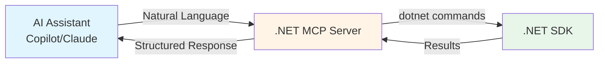
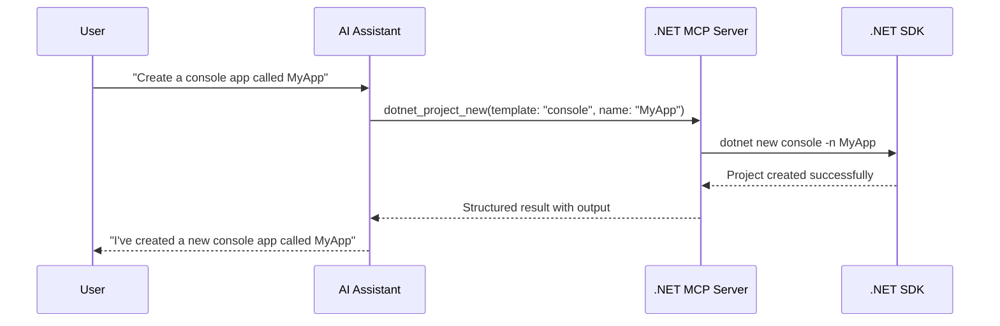
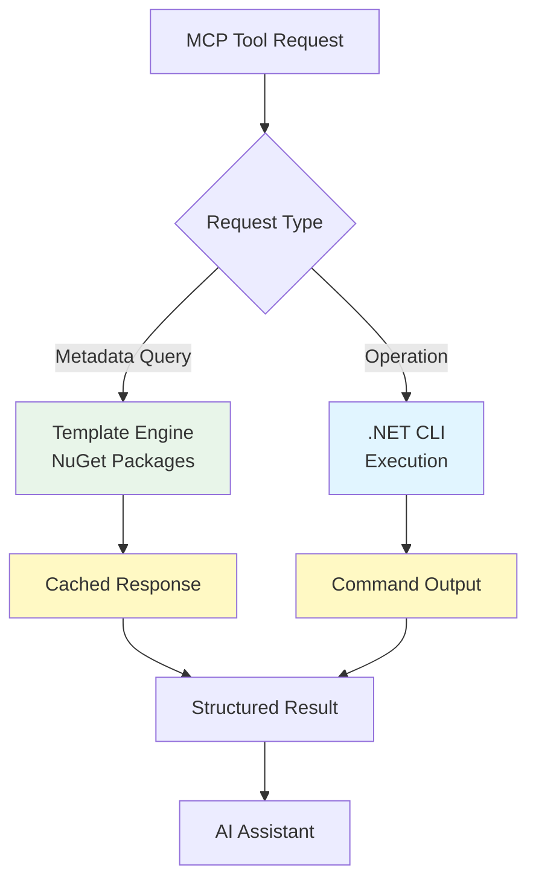

# .NET MCP Server

[](https://github.com/jongalloway/dotnet-mcp/actions/workflows/build.yml)
[](https://github.com/jongalloway/dotnet-mcp/blob/main/.github/dependabot.yml)
[](https://www.nuget.org/packages/Community.Mcp.DotNet/)

Give your AI assistant superpowers for .NET development! This MCP server connects GitHub Copilot, Claude, and other AI assistants directly to the .NET SDK, enabling them to create projects, manage packages, run builds, and more—all through natural language.

## Quick Install

Click to install in your preferred environment:

[](https://vscode.dev/redirect/mcp/install?name=dotnet-mcp&config=%7B%22type%22%3A%22stdio%22%2C%22command%22%3A%22dnx%22%2C%22args%22%3A%5B%22Community.Mcp.DotNet%400.1.0-%2A%22%2C%22--yes%22%5D%7D)
[](https://insiders.vscode.dev/redirect/mcp/install?name=dotnet-mcp&config=%7B%22type%22%3A%22stdio%22%2C%22command%22%3A%22dnx%22%2C%22args%22%3A%5B%22Community.Mcp.DotNet%400.1.0-%2A%22%2C%22--yes%22%5D%7D&quality=insiders)
[](https://vs-open.link/mcp-install?%7B%22name%22%3A%22Community.Mcp.DotNet%22%2C%22type%22%3A%22stdio%22%2C%22command%22%3A%22dnx%22%2C%22args%22%3A%5B%22Community.Mcp.Dotnet%400.1.0-%22%2C%22--yes%22%5D%7D)

> **Note**: Quick install requires .NET 10 SDK (launching November 2025). See [manual installation](#installation) for .NET 9 support.

## What is This?

The .NET MCP Server is a bridge that connects AI assistants to the .NET SDK using the [Model Context Protocol](https://modelcontextprotocol.io/). Think of it as giving your AI assistant a direct line to `dotnet` commands, but with intelligence and context.



## Why Use It?

### 🚀 **Faster Development**

Instead of remembering exact `dotnet` commands and syntax, just ask:

- *"Create a new web API project with Entity Framework"*
- *"Add the Serilog package and configure structured logging"*
- *"Update all my NuGet packages to the latest versions"*

### 🧠 **Smarter AI Assistance**

Your AI assistant gets direct access to:

- All installed .NET templates and their parameters
- NuGet package search and metadata
- Framework version information (including LTS status)
- Your solution and project structure

### 🎯 **Why Not Just Let the AI Call `dotnet` Directly?**

The .NET MCP Server provides **context and intelligence** that raw CLI execution cannot:

#### **1. Template Discovery & Validation**

- **With MCP**: AI knows exactly which templates are installed (`console`, `webapi`, `blazor`, etc.) and their parameters
- **Without MCP**: AI guesses template names and parameters, often getting them wrong

#### **2. Framework Intelligence**

- **With MCP**: AI knows which .NET versions are installed, which are LTS, and can recommend appropriately
- **Without MCP**: AI suggests `net8.0` when you only have `net9.0` installed, leading to errors

#### **3. Rich Tool Descriptions**

- **With MCP**: Each tool has detailed parameter descriptions and constraints (e.g., "configuration must be Debug or Release")
- **Without MCP**: AI constructs commands from general knowledge, missing version-specific changes

#### **4. Parameter Information**

- **With MCP**: AI sees template parameters like `--use-controllers`, `--auth`, framework options
- **Without MCP**: AI doesn't know what optional parameters exist for each template

#### **5. Package Search Integration**

- **With MCP**: AI can search NuGet.org to find exact package names and versions
- **Without MCP**: AI guesses package names, often suggesting outdated or incorrect ones

#### **6. Structured Error Handling**

- **With MCP**: Errors are parsed and returned in structured format the AI can understand
- **Without MCP**: AI gets raw stderr output and may misinterpret errors

#### **7. MCP Resources**

MCP Resources provide read-only access to structured metadata about your .NET environment:

- **dotnet://sdk-info** - Information about installed .NET SDKs (versions and paths)
- **dotnet://runtime-info** - Information about installed .NET runtimes (versions and types)
- **dotnet://templates** - Complete catalog of installed .NET templates with metadata
- **dotnet://frameworks** - Information about supported .NET frameworks (TFMs) including LTS status

This enables AI assistants to:

- Answer questions without executing commands ("What .NET versions do I have installed?")
- Provide context-aware suggestions based on your actual environment
- Access structured JSON data more efficiently than parsing CLI output
- Reference official .NET metadata for accurate recommendations

**Example**: Using resources for context-aware assistance

```text
❌ Without Resources:
User: "What .NET versions do I have?"
AI: Executes dotnet --list-sdks and parses output
User: "Which is LTS?"
AI: Executes dotnet --info and tries to parse support info

✅ With Resources:
User: "What .NET versions do I have?"
AI: Reads dotnet://sdk/list resource (no execution needed)
    Returns: .NET 8.0 (LTS), .NET 9.0 (STS), .NET 10.0 (STS)
User: "Which is LTS?"
AI: Already knows from resource metadata - .NET 8.0
```

**Example**: Creating a Blazor project with authentication

```text
❌ Without MCP:
AI: "I'll run: dotnet new blazor --auth Individual"
Result: Error - template 'blazor' doesn't support --auth parameter

✅ With MCP:
AI: Queries dotnet_template_info for 'blazor'
    Sees available parameters: --interactivity, --use-program-main, --empty
    Uses dotnet_template_search to find authentication templates
AI: "I'll create a Blazor Web App with authentication using the correct template..."
Result: Success - uses 'blazor' template with proper authentication configuration
```

### ✨ **Consistent Results**

The MCP server uses official .NET SDK APIs and CLI commands, ensuring:

- Accurate template information from the Template Engine
- Reliable command execution
- Proper error handling and validation

### 🔒 **Secure by Design**

- Runs locally on your machine
- No data sent to external servers
- You control what commands execute
- Standard .NET security model applies

## How It Works



The .NET MCP Server acts as an intelligent middleware that:

1. **Translates** natural language requests into structured .NET SDK operations
2. **Validates** parameters using official SDK metadata (templates, frameworks, packages)
3. **Executes** commands safely with proper error handling
4. **Returns** structured results that AI assistants can understand and explain

## Installation

### Requirements

- **For Quick Install**: .NET 10 SDK (launching November 2025)
- **For Manual Install**: .NET 9.0 SDK or later
- Visual Studio Code, Visual Studio 2022 (v17.13+), or Claude Desktop

### Option 1: Quick Install (Recommended)

Use the install badges at the top of this page to automatically configure the MCP server in your environment. The server will be downloaded from NuGet.org on first use.

### Option 2: Manual Configuration

### Template & Framework Information

- **dotnet_template_list** - List all installed .NET templates with metadata
- **dotnet_template_search** - Search for templates by name or description
- **dotnet_template_info** - Get detailed template information and parameters
- **dotnet_framework_info** - Get .NET framework version information and LTS status

### Project Management

- **dotnet_project_new** - Create new .NET projects from templates
- **dotnet_project_restore** - Restore project dependencies
- **dotnet_project_build** - Build .NET projects
- **dotnet_project_run** - Build and run .NET projects
- **dotnet_project_test** - Run unit tests
- **dotnet_project_publish** - Publish projects for deployment
- **dotnet_project_clean** - Clean build outputs
- **dotnet_pack_create** - Create NuGet packages from projects
- **dotnet_watch_run** - Run with file watching and hot reload
- **dotnet_watch_test** - Run tests with auto-restart on file changes
- **dotnet_watch_build** - Build with auto-rebuild on file changes

### Package Management

- **dotnet_package_add** - Add NuGet package references
- **dotnet_package_remove** - Remove NuGet package references
- **dotnet_package_search** - Search for NuGet packages on nuget.org
- **dotnet_package_update** - Update NuGet packages to newer versions
- **dotnet_package_list** - List package references (including outdated/deprecated)
- **dotnet_reference_add** - Add project-to-project references
- **dotnet_reference_remove** - Remove project-to-project references
- **dotnet_reference_list** - List project references

### Solution Management

- **dotnet_solution_create** - Create new solution files (.sln or .slnx format)
- **dotnet_solution_add** - Add projects to a solution
- **dotnet_solution_list** - List projects in a solution
- **dotnet_solution_remove** - Remove projects from a solution

### Code Quality

- **dotnet_format** - Format code according to .editorconfig and style rules

### Utilities

- **dotnet_nuget_locals** - Manage NuGet local caches (list, clear)

### SDK Information

- **dotnet_sdk_version** - Get .NET SDK version
- **dotnet_sdk_info** - Get detailed SDK and runtime information
- **dotnet_sdk_list** - List installed SDKs
- **dotnet_runtime_list** - List installed runtimes

### Help

- **dotnet_help** - Get help for any dotnet command

## How It Works Under the Hood



The .NET MCP Server uses a **hybrid architecture** for optimal performance and reliability:

### SDK Integration (Fast, Cached)

Uses official Microsoft NuGet packages for metadata operations:

- **Template Engine** - Queries installed templates, parameters, and metadata
- **MSBuild APIs** - Validates frameworks, reads project files
- **Caching** - Template data cached for 5 minutes to improve performance

### CLI Execution (Reliable, Proven)

Executes actual `dotnet` commands for operations:

- **Project creation** - `dotnet new`
- **Package management** - `dotnet add package`
- **Build operations** - `dotnet build`, `dotnet test`, `dotnet run`
- **Solution management** - `dotnet sln add`

This hybrid approach ensures both **speed** (for queries) and **reliability** (for operations).

📖 [Full SDK integration details](doc/sdk-integration.md)

## Building from Source

For development or contributing:

```bash
git clone https://github.com/jongalloway/dotnet-mcp.git
cd dotnet-mcp/DotNetMcp
dotnet build
```

**Run the server**:

```bash
dotnet run
```

The server communicates via stdio transport and is designed to be invoked by MCP clients.

#### Visual Studio Code

**Using Quick Install** (recommended - .NET 10 required):

1. Click the [VS Code Install badge](#quick-install) at the top of this page
2. Or manually add via Command Palette:
   - Press `Ctrl+Shift+P` (or `Cmd+Shift+P` on macOS)
   - Run **"GitHub Copilot: Add MCP Server"**
   - Enter:
     - **Name**: `dotnet`
     - **Type**: `stdio`
     - **Command**: `dnx`
     - **Arguments**: `Community.Mcp.DotNet@1.0.0 --yes`

**Manual Configuration** (for .NET 9 or source builds):

Edit your VS Code settings (`Ctrl+,` or `Cmd+,`, search for "mcp"):

```json
{
  "github.copilot.chat.mcp.servers": {
    "dotnet": {
      "type": "stdio",
      "command": "dotnet",
      "args": ["run", "--project", "/path/to/dotnet-mcp/DotNetMcp/DotNetMcp.csproj"]
    }
  }
}
```

📖 [Full VS Code MCP documentation](https://code.visualstudio.com/docs/copilot/customization/mcp-servers#_add-an-mcp-server)

#### Visual Studio 2022

**Requirements**: Visual Studio 2022 version 17.13 or later

**Using Quick Install** (recommended - .NET 10 required):

1. Click the [Visual Studio Install badge](#quick-install) at the top of this page
2. Or manually add via Options:
   - Go to **Tools** > **Options** > **GitHub Copilot** > **MCP Servers**
   - Click **Add**
   - Enter:
     - **Name**: `dotnet`
     - **Type**: `stdio`
     - **Command**: `dnx`
     - **Arguments**: `Community.Mcp.DotNet@1.0.0 --yes`

**Manual Configuration** (for .NET 9 or source builds):

1. Go to **Tools** > **Options** > **GitHub Copilot** > **MCP Servers**
2. Click **Add**
3. Enter:
   - **Name**: `dotnet`
   - **Type**: `stdio`
   - **Command**: `dotnet`
   - **Arguments**: `run --project C:\path\to\dotnet-mcp\DotNetMcp\DotNetMcp.csproj`

📖 [Full Visual Studio MCP documentation](https://learn.microsoft.com/en-us/visualstudio/ide/mcp-servers?view=vs-2022)

#### Claude Desktop

**Using DNX** (recommended - .NET 10 required):

**macOS**: Edit `~/Library/Application Support/Claude/claude_desktop_config.json`

```json
{
  "mcpServers": {
    "dotnet": {
      "command": "dnx",
      "args": ["Community.Mcp.DotNet@1.0.0", "--yes"]
    }
  }
}
```

**Windows**: Edit `%APPDATA%\Claude\claude_desktop_config.json`

```json
{
  "mcpServers": {
    "dotnet": {
      "command": "dnx",
      "args": ["Community.Mcp.DotNet@1.0.0", "--yes"]
    }
  }
}
```

**Manual Configuration** (for .NET 9 or source builds):

**macOS**:

```json
{
  "mcpServers": {
    "dotnet": {
      "command": "dotnet",
      "args": ["run", "--project", "/path/to/dotnet-mcp/DotNetMcp/DotNetMcp.csproj"]
    }
  }
}
```

**Windows**:

```json
{
  "mcpServers": {
    "dotnet": {
      "command": "dotnet",
      "args": ["run", "--project", "C:\\path\\to\\dotnet-mcp\\DotNetMcp\\DotNetMcp.csproj"]
    }
  }
}
```

## Usage Examples

Once configured, you can use natural language with your AI assistant:

### Getting Started

**User**: *"Create a new web API project called WeatherService"*

**AI**: *I'll create a new web API project for you...*

```bash
dotnet new webapi -n WeatherService
```

*The project has been created successfully in the WeatherService directory.*

### Managing Packages

**User**: *"Add Entity Framework Core and the SQL Server provider to my project"*

**AI**: *I'll add both packages...*

```bash
dotnet add package Microsoft.EntityFrameworkCore
dotnet add package Microsoft.EntityFrameworkCore.SqlServer
```

*Both packages have been added successfully.*

### Building and Testing

**User**: *"Build my solution in Release mode and run all tests"*

**AI**: *I'll build and test your solution...*

```bash
dotnet build -c Release
dotnet test
```

*Build succeeded. All 47 tests passed.*

### Exploring Options

**User**: *"What Blazor templates are available?"*

**AI**: *Here are the available Blazor templates:*

- `blazor` - Blazor Web App
- `blazorwasm` - Blazor WebAssembly App
- `blazorserver` - Blazor Server App

*Each template supports different hosting models and configurations.*

## Available Tools

The server provides comprehensive .NET development capabilities through MCP tools and resources:

### MCP Resources (Read-Only Context)

The server exposes read-only resources that provide efficient access to .NET environment metadata:

- **dotnet://sdk-info** - Information about installed .NET SDKs (versions and paths)
- **dotnet://runtime-info** - Information about installed .NET runtimes (versions and types)
- **dotnet://templates** - Complete catalog of installed .NET templates with metadata
- **dotnet://frameworks** - Information about supported .NET frameworks (TFMs) including LTS status

Resources provide structured JSON data and are more efficient than tool calls for frequently accessed read-only information.

### Template & Framework Information

- **dotnet_template_list** - List all installed .NET templates with metadata
- **dotnet_template_search** - Search for templates by name or description
- **dotnet_template_info** - Get detailed template information and parameters
- **dotnet_framework_info** - Get .NET framework version information and LTS status

### Project Management

- **dotnet_project_new** - Create new .NET projects from templates
- **dotnet_project_restore** - Restore project dependencies
- **dotnet_project_build** - Build .NET projects
- **dotnet_project_run** - Build and run .NET projects
- **dotnet_project_test** - Run unit tests
- **dotnet_project_publish** - Publish projects for deployment
- **dotnet_project_clean** - Clean build outputs
- **dotnet_pack_create** - Create NuGet packages from projects
- **dotnet_watch_run** - Run with file watching and hot reload
- **dotnet_watch_test** - Run tests with auto-restart on file changes
- **dotnet_watch_build** - Build with auto-rebuild on file changes

### Package Management

- **dotnet_package_add** - Add NuGet package references
- **dotnet_package_remove** - Remove NuGet package references
- **dotnet_package_search** - Search for NuGet packages on nuget.org
- **dotnet_package_update** - Update NuGet packages to newer versions
- **dotnet_package_list** - List package references (including outdated/deprecated)
- **dotnet_reference_add** - Add project-to-project references
- **dotnet_reference_remove** - Remove project-to-project references
- **dotnet_reference_list** - List project references

### Solution Management

- **dotnet_solution_create** - Create new solution files (.sln or .slnx format)
- **dotnet_solution_add** - Add projects to a solution
- **dotnet_solution_list** - List projects in a solution
- **dotnet_solution_remove** - Remove projects from a solution

### Code Quality

- **dotnet_format** - Format code according to .editorconfig and style rules

### Utilities

- **dotnet_nuget_locals** - Manage NuGet local caches (list, clear)

### SDK Information

- **dotnet_sdk_version** - Get .NET SDK version
- **dotnet_sdk_info** - Get detailed SDK and runtime information
- **dotnet_sdk_list** - List installed SDKs
- **dotnet_runtime_list** - List installed runtimes

### Help

- **dotnet_help** - Get help for any dotnet command

## Advanced Topics

### Performance Optimization

The server implements several performance optimizations:

- **Template caching** - Template Engine data cached for 5 minutes
- **Output limiting** - Command output limited to 1 million characters to prevent memory issues
- **Async operations** - All I/O operations use async/await patterns

### Logging

The server implements MCP-compliant logging:

- Logs are sent to the MCP client via the logging protocol
- Log levels: Debug, Information, Warning, Error
- Configurable logging level set by the client

### Security

The MCP server follows security best practices:

- **Local execution only** - All operations run on your local machine
- **No external communication** - No data sent to external servers
- **Standard permissions** - Uses your .NET SDK permissions
- **Input validation** - All parameters validated before execution
- **Path sanitization** - File paths validated to prevent directory traversal

## Project Structure

```text
dotnet-mcp/
├── DotNetMcp/
│   ├── DotNetMcp.csproj           # Project file
│   ├── Program.cs                  # MCP server setup
│   ├── DotNetCliTools.cs           # MCP tool implementations
│   ├── DotNetSdkConstants.cs       # Strongly-typed SDK constants
│   ├── TemplateEngineHelper.cs     # Template Engine integration
│   └── FrameworkHelper.cs          # Framework validation helpers
├── doc/
│   └── sdk-integration.md          # SDK integration documentation
├── .github/
│   ├── copilot-instructions.md     # Copilot development guidelines
│   └── workflows/
│       └── build.yml               # CI/CD workflow
└── README.md                       # This file
```

## Technology Stack

- **Protocol**: [Model Context Protocol (MCP)](https://modelcontextprotocol.io/)
- **SDK**: [MCP SDK for .NET](https://github.com/modelcontextprotocol/csharp-sdk) v0.4.0-preview.2
- **Runtime**: .NET 9.0 (target framework)
- **Transport**: stdio (standard input/output)
- **NuGet Packages**:
  - `Microsoft.TemplateEngine.Abstractions` & `Edge` - Template metadata
  - `Microsoft.Build.Utilities.Core` & `Microsoft.Build` - Project validation

## Documentation

- 📖 [SDK Integration Details](doc/sdk-integration.md) - Technical architecture and SDK usage
- 📖 [Model Context Protocol](https://modelcontextprotocol.io/) - Official MCP specification
- 📖 [MCP C# SDK Docs](https://modelcontextprotocol.github.io/csharp-sdk/) - SDK documentation

## Contributing

Contributions are welcome! This is a community-maintained project.

**Ways to contribute**:

- 🐛 Report bugs or request features via [GitHub Issues](https://github.com/jongalloway/dotnet-mcp/issues)
- 💡 Submit pull requests for new tools or improvements
- 📝 Improve documentation
- ⭐ Star the repo to show support

**Development setup**:

1. Fork the repository
2. Clone your fork
3. Create a feature branch
4. Make your changes
5. Test thoroughly
6. Submit a pull request

See [.github/copilot-instructions.md](.github/copilot-instructions.md) for development guidelines.

## Troubleshooting

### "dnx not found"

- **Cause**: .NET 10 SDK not installed
- **Solution**: Install [.NET 10 SDK](https://dotnet.microsoft.com/download) or use manual configuration with `dotnet run`

### "No templates found"

- **Cause**: .NET SDK templates not installed
- **Solution**: Run `dotnet new --install` to install default templates

### "Server not responding"

- **Cause**: Server crashed or failed to start
- **Solution**: Check logs in your MCP client, ensure .NET SDK is in PATH

### Need Help?

- 📖 Check the [documentation](#documentation)
- 💬 Open a [GitHub Issue](https://github.com/jongalloway/dotnet-mcp/issues)
- 🔍 Search [existing issues](https://github.com/jongalloway/dotnet-mcp/issues?q=is%3Aissue)

## License

MIT License - see [LICENSE](LICENSE) file for details.
