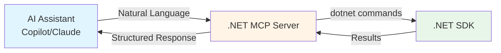
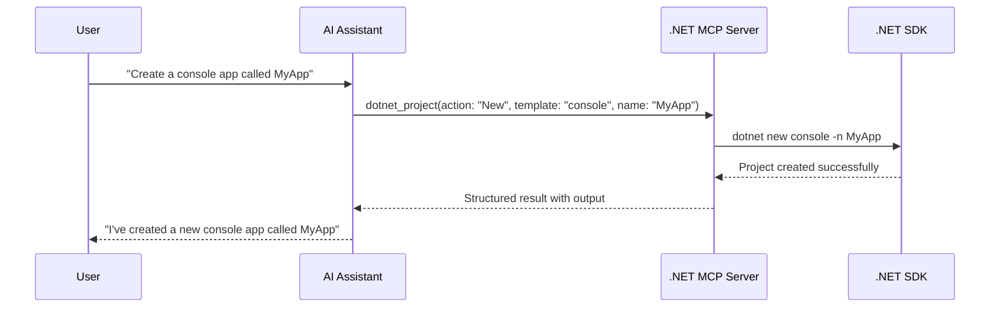

# .NET MCP Server

<!-- mcp-name: io.github.jongalloway/dotnet-mcp -->

[](https://github.com/jongalloway/dotnet-mcp/actions/workflows/build.yml)
[](https://codecov.io/gh/jongalloway/dotnet-mcp)
[](https://github.com/jongalloway/dotnet-mcp/blob/main/.github/dependabot.yml)
[](https://www.nuget.org/packages/Community.Mcp.DotNet/)
[](https://registry.modelcontextprotocol.io/?q=io.github.jongalloway%2Fdotnet-mcp)
[](https://github.com/jongalloway/dotnet-mcp/actions/workflows/codeql.yml)

Give your AI assistant superpowers for .NET development! This MCP server connects GitHub Copilot, Claude, and other AI assistants directly to the .NET SDK, enabling them to create projects, manage packages, run builds, and more—all through natural language.

## Quick Install

Click to install in your preferred environment:
[](https://vscode.dev/redirect/mcp/install?name=dotnet-mcp&config=%7B%22type%22%3A%22stdio%22%2C%22command%22%3A%22dnx%22%2C%22args%22%3A%5B%22Community.Mcp.DotNet%401.0.0%22%2C%22--yes%22%5D%7D)
[](https://insiders.vscode.dev/redirect/mcp/install?name=dotnet-mcp&config=%7B%22type%22%3A%22stdio%22%2C%22command%22%3A%22dnx%22%2C%22args%22%3A%5B%22Community.Mcp.DotNet%401.0.0%22%2C%22--yes%22%5D%7D&quality=insiders)
[](https://vs-open.link/mcp-install?%7B%22name%22%3A%22Community.Mcp.DotNet%22%2C%22type%22%3A%22stdio%22%2C%22command%22%3A%22dnx%22%2C%22args%22%3A%5B%22Community.Mcp.DotNet%401.0.0%22%2C%22--yes%22%5D%7D)

> **Note**: Quick install requires .NET 10 SDK.

## What is This?

The .NET MCP Server is a **Model Context Protocol (MCP) server** that connects AI assistants to the .NET SDK using the [Model Context Protocol](https://modelcontextprotocol.io/). Think of it as giving your AI assistant a direct line to `dotnet` commands, but with intelligence and context.

> **Important**: This package is designed exclusively as an **MCP server** for AI assistants. It is not intended for use as a library or for programmatic consumption in other .NET applications. The only supported use case is running it as an MCP server via `dnx` or `dotnet run`.



## Why Use It?

### 🚀 **Faster Development**

Instead of remembering exact `dotnet` commands and syntax, just ask:

- *"Create a new web API project with Entity Framework"*
- *"Add the Serilog package and configure structured logging"*
- *"Update all my NuGet packages to the latest versions"*

### 🧠 **Smarter AI Assistance**

Your AI assistant gets direct access to:

- All installed .NET templates and their parameters
- NuGet package search and metadata
- Framework version information (including LTS status)
- Your solution and project structure

### 🎯 **Why Not Just Let the AI Call `dotnet` Directly?**

The .NET MCP Server provides **context and intelligence** that raw CLI execution cannot:

#### **1. Template Discovery & Validation**

- **With MCP**: AI knows exactly which templates are installed (`console`, `webapi`, `blazor`, etc.) and their parameters
- **Without MCP**: AI guesses template names and parameters, often getting them wrong

#### **2. Framework Intelligence**

- **With MCP**: AI knows which .NET versions are installed, which are LTS, and can recommend appropriately
- **Without MCP**: AI suggests `net8.0` when you only have `net10.0` installed, leading to errors

#### **3. Rich Tool Descriptions**

- **With MCP**: Each tool has detailed parameter descriptions and constraints (e.g., "configuration must be Debug or Release")
- **Without MCP**: AI constructs commands from general knowledge, missing version-specific changes

#### **4. Parameter Information**

- **With MCP**: AI sees template parameters like `--use-controllers`, `--auth`, framework options
- **Without MCP**: AI doesn't know what optional parameters exist for each template

#### **5. Package Search Integration**

- **With MCP**: AI can search NuGet.org to find exact package names and versions
- **Without MCP**: AI guesses package names, often suggesting outdated or incorrect ones

#### **6. Structured Error Handling with Enhanced Diagnostics**

- **With MCP**: Errors are parsed and enriched with explanations, documentation links, and suggested fixes
- **Without MCP**: AI gets raw stderr output and may misinterpret errors

The server provides **enhanced error diagnostics** for 52 common error codes:

- Plain English explanations of what went wrong
- Direct links to official Microsoft documentation
- Specific suggested fixes with commands to resolve issues
- Support for CS####, MSB####, NU####, and NETSDK#### error codes

See [Error Diagnostics Documentation](doc/error-diagnostics.md) for details.

#### **7. MCP Resources**

MCP Resources provide read-only access to structured metadata about your .NET environment:

- **dotnet://sdk-info** - Information about installed .NET SDKs (versions and paths)
- **dotnet://runtime-info** - Information about installed .NET runtimes (versions and types)
- **dotnet://templates** - Complete catalog of installed .NET templates with metadata
- **dotnet://frameworks** - Information about supported .NET frameworks (TFMs) including LTS status

This enables AI assistants to:

- Answer questions without executing commands ("What .NET versions do I have installed?")
- Provide context-aware suggestions based on your actual environment
- Access structured JSON data more efficiently than parsing CLI output
- Reference official .NET metadata for accurate recommendations

**Example**: Using resources for context-aware assistance

```text
❌ Without Resources:
User: "What .NET versions do I have?"
AI: Executes dotnet --list-sdks and parses output
User: "Which is LTS?"
AI: Executes dotnet --info and tries to parse support info

✅ With Resources:
User: "What .NET versions do I have?"
AI: Reads dotnet://sdk-info resource (no execution needed)
    Returns: .NET 8.0 (LTS), .NET 9.0 (STS), .NET 10.0 (LTS)
User: "Which is LTS?"
AI: Already knows from resource metadata - .NET 8.0, .NET 10.0
```

**Example**: Creating a Blazor project with authentication

```text
❌ Without MCP:
AI: "I'll run: dotnet new blazor --auth Individual"
Result: Error - template 'blazor' doesn't support --auth parameter

✅ With MCP:
AI: Uses dotnet_sdk with action: "TemplateInfo" for 'blazor'
  Sees available parameters: --interactivity, --use-program-main, --empty
  Uses dotnet_sdk with action: "SearchTemplates" to find authentication templates
AI: "I'll create a Blazor Web App with authentication using the correct template..."
Result: Success - uses 'blazor' template with proper authentication configuration
```

### ✨ **Consistent Results**

The MCP server uses official .NET SDK APIs and CLI commands, ensuring:

- Accurate template information from the Template Engine
- Reliable command execution
- Proper error handling and validation

### 🔒 **Secure by Design**

- Runs locally on your machine
- No data sent to external servers
- You control what commands execute
- Standard .NET security model applies
- **Automatic secret redaction** to protect sensitive information in CLI output
  - Connection strings, passwords, and API keys are automatically redacted
  - Implemented using optimized regular expressions with <1% performance overhead
  - References Microsoft.Extensions.Compliance.Redaction for future integration
  - Opt-out available with `unsafeOutput=true` for advanced debugging
  - Patterns include: database credentials, cloud provider keys, tokens, certificates, and more
  - Performance impact is minimal and tested to complete within 500ms for 10,000 lines

## How It Works



The .NET MCP Server acts as an intelligent middleware that:

1. **Translates** natural language requests into structured .NET SDK operations
2. **Validates** parameters using official SDK metadata (templates, frameworks, packages)
3. **Executes** commands safely with proper error handling
4. **Returns** structured results that AI assistants can understand and explain

## Testing

See [doc/testing.md](doc/testing.md) for how to run the test suite, including opt-in scenario tests and long-running release-gate scenarios.

## Installation

### Requirements

- **For Quick Install**: .NET 10 SDK
- **For Manual Install**: .NET 10 SDK
- Visual Studio Code, Visual Studio 2022 (v17.13+), or Claude Desktop

### Option 1: Quick Install (Recommended)

Use the install badges at the top of this page to automatically configure the MCP server in your environment. The server will be downloaded from NuGet.org on first use.

### Option 2: Manual Configuration

Follow the instructions below for your specific development environment:

### Visual Studio Code

**Using Quick Install** (recommended - .NET 10 required):

1. Click the [VS Code Install badge](#quick-install) at the top of this page
2. Or manually add via Command Palette:
   - Press `Ctrl+Shift+P` (or `Cmd+Shift+P` on macOS)
   - Run **"GitHub Copilot: Add MCP Server"**
   - Enter:
     - **Name**: `dotnet`
     - **Type**: `stdio`
     - **Command**: `dnx`
     - **Arguments**: `Community.Mcp.DotNet@1.0.0 --yes`

**Manual Configuration** (for source builds or custom setups):

Edit your VS Code settings (`Ctrl+,` or `Cmd+,`, search for "mcp"):

```json
{
  "github.copilot.chat.mcp.servers": {
    "dotnet": {
      "type": "stdio",
      "command": "dotnet",
      "args": ["run", "--project", "/path/to/dotnet-mcp/DotNetMcp/DotNetMcp.csproj"]
    }
  }
}
```

📖 [Full VS Code MCP documentation](https://code.visualstudio.com/docs/copilot/customization/mcp-servers#_add-an-mcp-server)

### Visual Studio 2022

**Requirements**: Visual Studio 2022 version 17.13 or later

**Using Quick Install** (recommended - .NET 10 required):

1. Click the [Visual Studio Install badge](#quick-install) at the top of this page
2. Or manually add via Options:
   - Go to **Tools** > **Options** > **GitHub Copilot** > **MCP Servers**
   - Click **Add**
   - Enter:
     - **Name**: `dotnet`
     - **Type**: `stdio`
     - **Command**: `dnx`
     - **Arguments**: `Community.Mcp.DotNet@1.0.0 --yes`

**Manual Configuration** (for source builds or custom setups):

1. Go to **Tools** > **Options** > **GitHub Copilot** > **MCP Servers**
2. Click **Add**
3. Enter:
   - **Name**: `dotnet`
   - **Type**: `stdio`
   - **Command**: `dotnet`
   - **Arguments**: `run --project C:\path\to\dotnet-mcp\DotNetMcp\DotNetMcp.csproj`

📖 [Full Visual Studio MCP documentation](https://learn.microsoft.com/en-us/visualstudio/ide/mcp-servers?view=vs-2022)

### Claude Desktop

**Using DNX** (recommended - .NET 10 required):

**macOS**: Edit `~/Library/Application Support/Claude/claude_desktop_config.json`

```json
{
  "mcpServers": {
    "dotnet": {
      "command": "dnx",
      "args": ["Community.Mcp.DotNet@1.0.0", "--yes"]
    }
  }
}
```

**Windows**: Edit `%APPDATA%\Claude\claude_desktop_config.json`

```json
{
  "mcpServers": {
    "dotnet": {
      "command": "dnx",
      "args": ["Community.Mcp.DotNet@1.0.0", "--yes"]
    }
  }
}
```

**Manual Configuration** (for source builds or custom setups):

**macOS**:

```json
{
  "mcpServers": {
    "dotnet": {
      "command": "dotnet",
      "args": ["run", "--project", "/path/to/dotnet-mcp/DotNetMcp/DotNetMcp.csproj"]
    }
  }
}
```

**Windows**:

```json
{
  "mcpServers": {
    "dotnet": {
      "command": "dotnet",
      "args": ["run", "--project", "C:\\path\\to\\dotnet-mcp\\DotNetMcp\\DotNetMcp.csproj"]
    }
  }
}
```

### GitHub Copilot coding agent (Repository MCP configuration)

You can also configure this MCP server at the **repository** level for GitHub Copilot coding agent.

1. Open your repo on GitHub
2. Go to **Settings** > **Copilot** > **Coding agent**
3. Paste the JSON below into the MCP configuration box
4. Click **Save**

For details, see GitHub's documentation: [Extending GitHub Copilot coding agent with the Model Context Protocol (MCP)](https://docs.github.com/copilot/how-tos/use-copilot-agents/coding-agent/extend-coding-agent-with-mcp)

```json
{
  "mcpServers": {
    "dotnet": {
      "type": "local",
      "command": "dnx",
      "args": ["Community.Mcp.DotNet@1.0.0", "--yes"],
      "tools": [
        "dotnet_project",
        "dotnet_package",
        "dotnet_solution",
        "dotnet_sdk",
        "dotnet_help",
        "dotnet_server_capabilities",
        "dotnet_server_info"
      ]
    }
  }
}
```

This configuration uses a curated allowlist of tools (instead of `"*"`) so the agent can use the .NET MCP server safely and predictably.

Note: Copilot coding agent runs on GitHub Actions runners. If you need to ensure .NET 10 is installed for your repository, add a setup workflow like [.github/workflows/copilot-setup-steps.yml](.github/workflows/copilot-setup-steps.yml).

## Usage Examples

Once configured, you can use natural language with your AI assistant:

### Quick Start - Single Project

**User**: *"Create a new web API project called WeatherService"*

**AI**: *I'll create a new web API project for you...*

```bash
dotnet new webapi -n WeatherService
```

*The project has been created successfully in the WeatherService directory.*

### Complex Application - Microservices with Aspire

**User**: *"Create a server-side web app and minimal API, orchestrated by .NET Aspire, with unit tests for the API using xunit. Use slnx format for the solution."*

**AI**: *I'll create a complete microservices solution with .NET Aspire orchestration...*

```bash
# Create solution with new XML format
dotnet new sln -n MyMicroservices --use-slnx

# Create .NET Aspire AppHost for orchestration
dotnet new aspire-apphost -n MyMicroservices.AppHost

# Create web app
dotnet new webapp -n MyMicroservices.Web

# Create minimal API
dotnet new webapi -n MyMicroservices.Api --use-minimal-apis

# Create test project
dotnet new xunit -n MyMicroservices.Api.Tests

# Add projects to solution
dotnet sln add MyMicroservices.AppHost/MyMicroservices.AppHost.csproj
dotnet sln add MyMicroservices.Web/MyMicroservices.Web.csproj
dotnet sln add MyMicroservices.Api/MyMicroservices.Api.csproj
dotnet sln add MyMicroservices.Api.Tests/MyMicroservices.Api.Tests.csproj

# Add project references for tests
dotnet add MyMicroservices.Api.Tests/MyMicroservices.Api.Tests.csproj reference MyMicroservices.Api/MyMicroservices.Api.csproj
```

*Solution created with 4 projects: AppHost for orchestration, Web app, API, and unit tests. Ready to run with `dotnet run --project MyMicroservices.AppHost`.*

### Database-Driven Application with Entity Framework

**User**: *"Set up Entity Framework Core with SQL Server for my API and create the initial database migration"*

**AI**: *I'll add EF Core packages, install the dotnet-ef tool, and create your initial migration...*

```bash
# Add Entity Framework packages
dotnet add package Microsoft.EntityFrameworkCore
dotnet add package Microsoft.EntityFrameworkCore.SqlServer
dotnet add package Microsoft.EntityFrameworkCore.Design

# Install dotnet-ef tool globally
dotnet tool install dotnet-ef --global

# Create initial migration
dotnet ef migrations add InitialCreate

# Apply migration to create database
dotnet ef database update
```

*Entity Framework Core with SQL Server provider added. Initial migration created and applied. Database is ready for use.*

**User**: *"I added a Product entity to my DbContext. Update the database schema"*

**AI**: *I'll create a migration for your Product entity and apply it...*

```bash
# Create migration for new entity
dotnet ef migrations add AddProductEntity

# List migrations to see what's pending
dotnet ef migrations list

# Apply the migration
dotnet ef database update
```

*Migration created for Product entity (new table with Id, Name, Price, CreatedDate columns). Database updated successfully.*

**User**: *"Generate SQL script for the last migration so I can review it before production deployment"*

**AI**: *I'll generate an idempotent SQL script from your migration...*

```bash
# Generate idempotent SQL script (can be run multiple times safely)
dotnet ef migrations script --idempotent --output deploy.sql
```

*SQL script generated to deploy.sql. This script can be safely run multiple times and will only apply changes if needed.*

### Database-First Development

**User**: *"I have an existing SQL Server database. Reverse engineer it to Entity Framework classes"*

**AI**: *I'll scaffold your database into Entity Framework Core entities...*

```bash
# Reverse engineer (scaffold) database to EF Core entities
dotnet ef dbcontext scaffold "Server=localhost;Database=MyExistingDb;Trusted_Connection=true;" Microsoft.EntityFrameworkCore.SqlServer --output-dir Models

# List the generated DbContext classes
dotnet ef dbcontext list

# Get detailed info about the DbContext
dotnet ef dbcontext info
```

*Database scaffolded successfully. Generated MyExistingDbContext.cs and 15 entity classes (Customer, Order, Product, etc.) in the Models folder.*

### Multi-Target Testing Strategy

**User**: *"Add integration tests using NUnit that target both .NET 8 and .NET 10, and configure them to run with code coverage"*

**AI**: *I'll set up multi-targeted integration tests with coverage...*

```bash
# Create NUnit test project
dotnet new nunit -n MyMicroservices.IntegrationTests

# Update project to multi-target (edit .csproj)
# <TargetFrameworks>net8.0;net10.0</TargetFrameworks>

# Add integration test packages
dotnet add MyMicroservices.IntegrationTests package Microsoft.AspNetCore.Mvc.Testing
dotnet add MyMicroservices.IntegrationTests package Microsoft.Testing.Extensions.CodeCoverage

# Run tests with coverage for both frameworks
dotnet test -- --coverage --coverage-output-format cobertura
```

*Integration test project created with multi-targeting. Tests will run on both .NET 8 and .NET 10 with code coverage enabled.*

### Exploring and Discovering

**User**: *"What templates are available for creating cloud-native applications?"*

**AI**: *Let me search for cloud-native related templates...*

```bash
dotnet new search aspire
dotnet new search dapr
dotnet new search azure
```

*Found templates:*

- `aspire` - .NET Aspire Application
- `aspire-apphost` - .NET Aspire App Host
- `aspire-servicedefaults` - .NET Aspire Service Defaults
- `dapr` - Dapr application templates
- Various Azure Functions and Container Apps templates

*Each template is designed for cloud-native microservices and distributed applications.*

### Modernization Workflow

**User**: *"Update all packages to latest versions, format all code to match our editorconfig rules, then build and run tests"*

**AI**: *I'll update packages, format code, build, and test...*

```bash
# Update all packages to latest compatible versions
dotnet package update

# Format all code according to .editorconfig
dotnet format

# Clean and rebuild
dotnet clean
dotnet build -c Release

# Run all tests
dotnet test --verbosity detailed
```

*All packages updated to latest versions. Code formatted consistently across solution. Build succeeded with 0 warnings. All 156 tests passed.*

### HTTPS Development Setup

**User**: *"I'm getting HTTPS certificate errors when running my web app"*

**AI**: *Let me check your HTTPS development certificate...*

```bash
# Check certificate status
dotnet dev-certs https --check --trust
```

*Your certificate isn't trusted. Let me fix that...*

```bash
# Trust the certificate (may require elevation)
dotnet dev-certs https --trust
```

*Certificate is now trusted. Try running your app again. If you're using Docker, you can export the certificate:*

```bash
# Export for Docker containers
dotnet dev-certs https --export-path ./certs/aspnetapp.pfx --password "SecurePassword123!"
```

*Certificate exported to ./certs/aspnetapp.pfx. You can now mount it in your Docker container.*

### Secure Configuration with User Secrets

**User**: *"Set up user secrets for my API project with a database connection string"*

**AI**: *I'll initialize user secrets for your project...*

```bash
# Initialize user secrets (adds UserSecretsId to project file)
dotnet user-secrets init --project MyApi/MyApi.csproj
```

*Now I'll add your database connection string securely...*

```bash
# Store connection string (not committed to Git)
dotnet user-secrets set "ConnectionStrings:DefaultConnection" "Server=localhost;Database=MyDb;User=dev;Password=secret123"
```

*Secret stored! You can also add API keys:*

```bash
# Add Azure OpenAI API key
dotnet user-secrets set "Azure:OpenAI:ApiKey" "sk-..."

# Add SendGrid API key
dotnet user-secrets set "SendGrid:ApiKey" "SG...."
```

*Let me show you what's configured:*

```bash
# List all secrets
dotnet user-secrets list
```

*Output:*

```text
ConnectionStrings:DefaultConnection = Server=localhost;Database=MyDb;User=dev;Password=secret123
Azure:OpenAI:ApiKey = sk-...
SendGrid:ApiKey = SG....
```

*These secrets are stored in your user profile (not in the project) and won't be committed to Git. In your code, access them like:*

```csharp
var connectionString = builder.Configuration["ConnectionStrings:DefaultConnection"];
var apiKey = builder.Configuration["Azure:OpenAI:ApiKey"];
```

*Note: User secrets are for **development only**. Use Azure Key Vault or environment variables for production.*

### Mobile and MAUI Development Setup

**User**: *"I want to develop a .NET MAUI app for Android and iOS"*

**AI**: *I'll help you set up the necessary workloads for MAUI development...*

```bash
# First, let's see what MAUI workloads are available
dotnet workload search maui
```

*Found workloads:*

```text
Workload ID       Description              
-------------------------------------------
maui-android      .NET MAUI SDK for Android
maui-ios          .NET MAUI SDK for iOS    
maui-windows      .NET MAUI SDK for Windows
maui-tizen        .NET MAUI SDK for Tizen  
```

*Now I'll install the workloads you need:*

```bash
# Install MAUI workloads for Android and iOS
# Warning: This will download several GB of SDKs and tools
dotnet workload install maui-android maui-ios
```

> **Note**: The command above shows the raw `dotnet` CLI syntax, which uses space-separated workload IDs. When calling the .NET MCP workload install tool, pass workload IDs as a single comma-separated parameter, for example: `workloadIds: "maui-android,maui-ios"`. The MCP server will translate this into the equivalent CLI command.

*Workloads installed! Let's verify:*

```bash
# List installed workloads
dotnet workload list
```

*Output:*

```text
Installed Workload Id    Manifest Version      Installation Source
----------------------------------------------------------------------
maui-android            10.0.100/10.0.100     SDK 10.0.100        
maui-ios                10.0.100/10.0.100     SDK 10.0.100        
```

*Now you can create a MAUI project:*

```bash
# Create a new MAUI app
dotnet new maui -n MyMauiApp
```

*Your MAUI development environment is ready! When SDK updates are available, update your workloads:*

```bash
# Update all installed workloads
dotnet workload update
```

## Available Tools

The server provides comprehensive .NET development capabilities through **consolidated MCP tools** that group related operations by domain, making it easier for AI assistants to select the right tool and compose workflows.

> **Note**: The .NET MCP Server uses **consolidated tools only**. Each consolidated tool provides multiple related operations through an `action` parameter. This design improves AI orchestration and provides better semantic organization compared to having individual tools for each operation.

### MCP Resources (Read-Only Context)

The server exposes read-only resources that provide efficient access to .NET environment metadata:

- **dotnet://sdk-info** - Information about installed .NET SDKs (versions and paths)
- **dotnet://runtime-info** - Information about installed .NET runtimes (versions and types)
- **dotnet://templates** - Complete catalog of installed .NET templates with metadata
- **dotnet://frameworks** - Information about supported .NET frameworks (TFMs) including LTS status

Resources provide structured JSON data and are more efficient than tool calls for frequently accessed read-only information.

### Consolidated Tools

**These tools group related operations using action enums, providing better AI orchestration and clearer semantic organization.**

#### dotnet_project - Project Lifecycle Management

Unified interface for all project operations: **New**, **Restore**, **Build**, **Run**, **Test**, **Publish**, **Clean**, **Analyze**, **Dependencies**, **Validate**, **Pack**, **Watch**, **Format**

**SDK Compatibility Note**: The Test action uses `--project` by default (requires .NET SDK 8+ with MTP or SDK 10+). For older SDKs, set `useLegacyProjectArgument: true` to use the legacy positional argument format.

Example:

```typescript
// Create a new web API project
await callTool("dotnet_project", { 
  action: "New", 
  template: "webapi", 
  name: "MyApi" 
});

// Build the project
await callTool("dotnet_project", { 
  action: "Build", 
  project: "MyApi/MyApi.csproj", 
  configuration: "Release" 
});

// Run tests (uses --project by default)
await callTool("dotnet_project", { 
  action: "Test", 
  project: "MyApi.Tests/MyApi.Tests.csproj" 
});

// Run tests with legacy SDK (positional argument)
await callTool("dotnet_project", { 
  action: "Test", 
  project: "MyApi.Tests/MyApi.Tests.csproj",
  useLegacyProjectArgument: true
});
```

#### dotnet_package - Package and Reference Management

Manage NuGet packages and project references: **Add**, **Remove**, **Search**, **Update**, **List**, **AddReference**, **RemoveReference**, **ListReferences**, **ClearCache**

Example:

```typescript
// Search for a package
await callTool("dotnet_package", { 
  action: "Search", 
  searchTerm: "serilog" 
});

// Add package to project
await callTool("dotnet_package", { 
  action: "Add", 
  packageId: "Serilog.AspNetCore", 
  project: "MyApi/MyApi.csproj" 
});
```

#### dotnet_solution - Solution File Management

**Full parity with `dotnet sln` / `dotnet solution` CLI commands.**

Manage solution files and project membership: **Create**, **Add**, **List**, **Remove**

Examples:

```typescript
// Create a solution (classic .sln format)
await callTool("dotnet_solution", { 
  action: "Create", 
  name: "MyApp"
});

// Create a solution (new .slnx XML format)
await callTool("dotnet_solution", { 
  action: "Create", 
  name: "MyApp", 
  format: "slnx" 
});

// Add projects to solution
await callTool("dotnet_solution", { 
  action: "Add", 
  solution: "MyApp.slnx", 
  projects: ["MyApi/MyApi.csproj", "MyWeb/MyWeb.csproj"] 
});

// List projects in solution
await callTool("dotnet_solution", { 
  action: "List", 
  solution: "MyApp.slnx"
});

// Remove projects from solution
await callTool("dotnet_solution", { 
  action: "Remove", 
  solution: "MyApp.slnx", 
  projects: ["MyWeb/MyWeb.csproj"] 
});
```

#### dotnet_ef - Entity Framework Core Operations

Database migrations, DbContext management, and scaffolding: **MigrationsAdd**, **MigrationsList**, **MigrationsRemove**, **MigrationsScript**, **DatabaseUpdate**, **DatabaseDrop**, **DbContextList**, **DbContextInfo**, **DbContextScaffold**

Example:

```typescript
// Create a migration
await callTool("dotnet_ef", { 
  action: "MigrationsAdd", 
  name: "InitialCreate", 
  project: "MyApi/MyApi.csproj" 
});

// Update database
await callTool("dotnet_ef", { 
  action: "DatabaseUpdate", 
  project: "MyApi/MyApi.csproj" 
});
```

#### dotnet_workload - Workload Management

Install and manage .NET workloads (MAUI, WASM, etc.): **List**, **Info**, **Search**, **Install**, **Update**, **Uninstall**

Example:

```typescript
// Search for workloads
await callTool("dotnet_workload", { 
  action: "Search", 
  searchTerm: "maui" 
});

// Install workloads
await callTool("dotnet_workload", { 
  action: "Install", 
  workloadIds: "maui-android,maui-ios" 
});
```

#### dotnet_tool - .NET Tool Management

Manage global and local .NET tools: **Install**, **List**, **Update**, **Uninstall**, **Restore**, **CreateManifest**, **Search**, **Run**

Example:

```typescript
// Install a tool globally
await callTool("dotnet_tool", { 
  action: "Install", 
  packageId: "dotnet-ef", 
  global: true 
});

// Search for tools
await callTool("dotnet_tool", { 
  action: "Search", 
  searchTerm: "format" 
});
```

#### dotnet_sdk - SDK and Template Information

Query SDK, runtime, template, and framework information: **Version**, **Info**, **ListSdks**, **ListRuntimes**, **ListTemplates**, **SearchTemplates**, **TemplateInfo**, **ListTemplatePacks**, **InstallTemplatePack**, **UninstallTemplatePack**, **ClearTemplateCache**, **FrameworkInfo**, **CacheMetrics**

Example:

```typescript
// Get SDK version
await callTool("dotnet_sdk", { 
  action: "Version" 
});

// List available templates
await callTool("dotnet_sdk", { 
  action: "ListTemplates" 
});

// Search for templates
await callTool("dotnet_sdk", { 
  action: "SearchTemplates", 
  searchTerm: "web" 
});

// List installed template packs
await callTool("dotnet_sdk", {
  action: "ListTemplatePacks"
});

// Install a template pack (NuGet package ID + version)
await callTool("dotnet_sdk", {
  action: "InstallTemplatePack",
  templatePackage: "Aspire.ProjectTemplates",
  templateVersion: "13.1.0"
});

// Uninstall a template pack
await callTool("dotnet_sdk", {
  action: "UninstallTemplatePack",
  templatePackage: "Aspire.ProjectTemplates"
});
```

#### dotnet_dev_certs - Developer Certificates and Secrets

Manage HTTPS certificates and user secrets: **CertificateTrust**, **CertificateCheck**, **CertificateClean**, **CertificateExport**, **SecretsInit**, **SecretsSet**, **SecretsList**, **SecretsRemove**, **SecretsClear**

Example:

```typescript
// Trust development certificate
await callTool("dotnet_dev_certs", { 
  action: "CertificateTrust" 
});

// Set a user secret
await callTool("dotnet_dev_certs", { 
  action: "SecretsSet", 
  key: "ConnectionStrings:DefaultConnection", 
  value: "Server=localhost;Database=MyDb", 
  project: "MyApi/MyApi.csproj" 
});
```

### Utility Tools

- **dotnet_help** - Get help for any dotnet command
- **dotnet_server_capabilities** - Get MCP server capabilities and concurrency guidance

## Building from Source

For development or contributing:

```bash
git clone https://github.com/jongalloway/dotnet-mcp.git
cd dotnet-mcp
dotnet build --project DotNetMcp/DotNetMcp.csproj
```

**Run the server**:

```bash
dotnet run --project DotNetMcp/DotNetMcp.csproj
```

The server communicates via stdio transport and is designed to be invoked by MCP clients.

## Project Structure

This project has grown beyond the point where a complete file-by-file listing stays useful.
Instead, this section highlights the key entry points and the main areas of the repo.

```text
dotnet-mcp/
├── DotNetMcp/                  # Main MCP server project (packed as a .NET tool)
│   ├── Program.cs              # Hosting + MCP server wiring
│   ├── DotNetMcp.csproj        # NuGet/package metadata (PackAsTool, server.json packing)
│   ├── .mcp/server.json        # MCP server metadata (packed into the NuGet package)
│   ├── Resources/              # MCP resources (SDK/runtime/templates/frameworks)
│   ├── DotNetCliTools.cs       # Tool surface area (split into partials in Tools/)
│   └── Tools/                  # Tool implementations grouped by domain (project, package, EF, etc.)
├── DotNetMcp.Tests/            # Unit + integration tests
├── doc/                        # Long-form documentation (architecture, concurrency, testing, etc.)
├── scripts/                    # Maintenance & validation scripts
├── artifacts*/                 # Build outputs (CI + local)
├── .github/                    # CI workflows and repo automation
├── DotNetMcp.slnx              # Solution file (.slnx)
├── global.json                 # SDK pinning for consistent builds
├── .config/dotnet-tools.json   # Local tool manifest (dotnet local tools)
└── LICENSE                     # MIT License
```

Key files to start with:

- `DotNetMcp/Program.cs` - server startup and registration
- `DotNetMcp/DotNetCliTools.cs` and `DotNetMcp/Tools/` - MCP tool implementations
- `DotNetMcp/Resources/DotNetResources.cs` - read-only MCP resources
- `DotNetMcp/.mcp/server.json` - packaged MCP server metadata
- `DotNetMcp.Tests/` - tests (including server.json validation and XML doc coverage)

## Technology Stack

- **Protocol**: [Model Context Protocol (MCP)](https://modelcontextprotocol.io/)
- **SDK**: [MCP SDK for .NET](https://github.com/modelcontextprotocol/csharp-sdk) v0.5.0-preview.1
- **Runtime**: .NET 10.0 (target framework)
- **Transport**: stdio (standard input/output)
- **NuGet Packages**:
  - `Microsoft.TemplateEngine.Abstractions` & `Edge` (v10.0.101) - Template metadata
  - `Microsoft.Build.Utilities.Core` & `Microsoft.Build` (v18.0.2) - Project validation

## Documentation

- 📖 [CHANGELOG](CHANGELOG.md) - **Version history and release notes**
- 📖 [AI Assistant Best Practices Guide](doc/ai-assistant-guide.md) - **Workflows, prompts, integration patterns, and troubleshooting**
- 📖 [Machine-Readable JSON Contract](doc/machine-readable-contract.md) - **v1.0 stable contract for programmatic tool consumption**
- 📖 [Tool Surface Consolidation](doc/tool-surface-consolidation.md) - **Consolidated tool design and architecture**
- 📖 [SDK Integration Details](doc/sdk-integration.md) - Technical architecture and SDK usage
- 📖 [Advanced Topics](doc/advanced-topics.md) - Performance, logging, and security details
- 📖 [Concurrency Safety](doc/concurrency.md) - Parallel execution guidance for AI orchestrators
- 📖 [Testing](doc/testing.md) - How to run tests (including opt-in interactive tests)
- 📖 [Model Context Protocol](https://modelcontextprotocol.io/) - Official MCP specification
- 📖 [MCP C# SDK Docs](https://modelcontextprotocol.github.io/csharp-sdk/) - SDK documentation

## Interoperability

The .NET MCP Server follows the Model Context Protocol specification and provides rich metadata for tool discovery and AI orchestration:

### Server Metadata

The server includes an MCP Registry `server.json` configuration file (`.mcp/server.json`) that provides:

- **Environment Variables**: Optimized .NET CLI settings for MCP usage
  - `DOTNET_SKIP_FIRST_TIME_EXPERIENCE=1` - Skips first-time setup
  - `DOTNET_NOLOGO=1` - Suppresses startup messages
  
- **Package Information**: NuGet package details for easy installation via `dnx` (requires .NET 10)
  - Package: `Community.Mcp.DotNet`
  - Registry: NuGet.org
  - Transport: stdio

- **Repository Information**: Links back to the source repo

Tool and resource metadata is discovered at runtime via the MCP protocol (tool/resource listing), using XML docs and `[McpMeta]` attributes in the server code.

### Tool Namespacing

All tools use the `dotnet_` prefix in their external IDs to prevent naming collisions with other MCP servers. This follows best practices for MCP server interoperability:

**Examples:**

- `dotnet_project` - Project lifecycle operations (create/build/test/run/publish)
- `dotnet_package` - NuGet packages and project references
- `dotnet_solution` - Solution operations
- `dotnet_sdk` - SDK/runtime/template/framework metadata

### Discovery Metadata

Tool discovery metadata (categories, tags, commonly-used hints) is provided via `[McpMeta]` attributes and surfaced through MCP tool listing.

### Metadata Access

AI orchestrators can access server metadata through:

1. **MCP Protocol**: Standard tool/resource listing via MCP SDK
2. **server.json**: Static metadata file for registration and discovery
3. **Tool Attributes**: Runtime metadata via `McpMeta` attributes in code

For detailed integration examples, see the [MCP specification](https://modelcontextprotocol.io/) and our [SDK integration documentation](doc/sdk-integration.md).

## Contributing

Contributions are welcome! This is a community-maintained project.

**Ways to contribute**:

- 🐛 Report bugs or request features via [GitHub Issues](https://github.com/jongalloway/dotnet-mcp/issues)
- 💡 Submit pull requests for new tools or improvements
- 📝 Improve documentation
- ⭐ Star the repo to show support

**Development setup**:

1. Fork the repository
2. Clone your fork
3. Create a feature branch
4. Make your changes
5. Test thoroughly
6. Submit a pull request

See [.github/copilot-instructions.md](.github/copilot-instructions.md) for development guidelines.

## Troubleshooting

### "dnx not found"

- **Cause**: .NET 10 SDK not installed
- **Solution**: Install [.NET 10 SDK](https://dotnet.microsoft.com/download) or use manual configuration with `dotnet run`

### "No templates found"

- **Cause**: .NET SDK templates not installed
- **Solution**: Run `dotnet new --install` to install default templates

### "Server not responding"

- **Cause**: Server crashed or failed to start
- **Solution**: Check logs in your MCP client, ensure .NET SDK is in PATH

### "Unrecognized option '--project'" when running tests

- **Cause**: Older .NET SDK or non-MTP test environment
- **Solution**: The `dotnet test --project` flag requires .NET SDK 8.0+ with Microsoft Testing Platform (MTP) enabled, or .NET SDK 10.0+. You have two options:
  1. **Upgrade SDK** (recommended): Install [.NET 10 SDK](https://dotnet.microsoft.com/download)
  2. **Use legacy mode**: Set `useLegacyProjectArgument: true` when calling `dotnet_project` with the `Test` action to use the older positional argument format (`dotnet test MyProject.csproj` instead of `dotnet test --project MyProject.csproj`)
- **Verify support**: Run `dotnet test --help | grep "\-\-project"` to check if your SDK supports the `--project` flag
- **More info**: See [doc/testing.md](doc/testing.md) for detailed MTP configuration and troubleshooting

### Need Help?

- 📖 Check the [documentation](#documentation)
- 💬 Open a [GitHub Issue](https://github.com/jongalloway/dotnet-mcp/issues)
- 🔍 Search [existing issues](https://github.com/jongalloway/dotnet-mcp/issues?q=is%3Aissue)

## Related Microsoft MCPs

This .NET MCP server focuses on .NET SDK operations (build, run, test, templates, SDK management). For specialized scenarios, consider these complementary official Microsoft MCP servers:

- **[NuGet MCP Server](https://www.nuget.org/packages/NuGet.Mcp.Server)** - Advanced NuGet package search, metadata, and automation scenarios beyond basic package management
- **[Aspire MCP Server](https://aspire.dev/dashboard/mcp-server/)** - Runtime monitoring, telemetry, distributed tracing, and resource management for .NET Aspire applications

These MCPs work alongside the .NET MCP to provide comprehensive coverage of the .NET development lifecycle:

| Feature | .NET MCP | NuGet MCP | Aspire MCP |
| ------- | -------- | --------- | ---------- |
| **Primary Focus** | .NET SDK operations | Package metadata/discovery | Runtime monitoring |
| **Scope** | CLI commands (build, run, test) | NuGet search & automation | Aspire app telemetry |
| **Stage** | Development time | Development/discovery time | Runtime/production |
| **Example Operations** | `dotnet build`, `dotnet new` | Package search, READMEs | Log viewing, tracing |

## License

MIT License - see [LICENSE](LICENSE) file for details.
