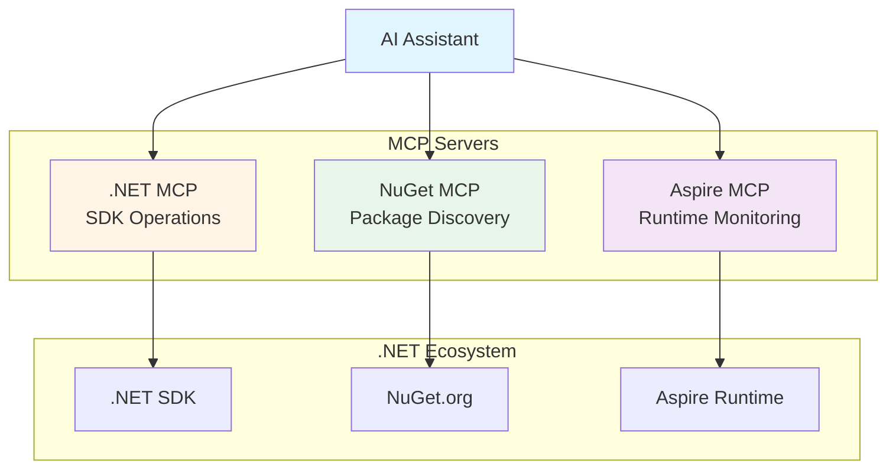

# AI Assistant Best Practices Guide

This guide helps you get the most value from the .NET MCP Server with AI assistants like GitHub Copilot, Claude, and other MCP-compatible tools.

## Table of Contents

- [Getting Started](#getting-started)
- [Common Workflows](#common-workflows)
- [Complex Scenarios](#complex-scenarios)
- [Integration with Microsoft MCPs](#integration-with-microsoft-mcps)
- [Best Practices](#best-practices)
- [Troubleshooting](#troubleshooting)
- [Concurrency and Orchestration](#concurrency-and-orchestration)

## Getting Started

### Understanding Consolidated Tools

The .NET MCP Server uses **consolidated tools** that group related operations by domain:

**Consolidated Tools:**

- **8 domain-focused tools** (dotnet_project, dotnet_package, dotnet_ef, etc.)
- **Action-based** - Single tool with multiple actions (e.g., `dotnet_project` with action "New", "Build", "Test")
- **Better AI orchestration** - Fewer tools means better tool selection by AI assistants
- **Clear semantic grouping** - Related operations grouped by domain

**Example:**

```typescript
// All project operations use dotnet_project with different actions
await callTool("dotnet_project", { action: "New", template: "webapi", name: "MyApi" });
await callTool("dotnet_project", { action: "Build", configuration: "Release" });
await callTool("dotnet_project", { action: "Test", filter: "Category=Unit" });
```

### First Steps with Your AI Assistant

Once you've installed the .NET MCP Server, start with simple requests to verify everything works:

**Verify Installation:**

```text
User: "What .NET SDKs do I have installed?"
AI: Reads dotnet://sdk-info resource
    Returns: .NET 8.0.403, .NET 10.0.101 (with paths)
```

**Explore Available Templates (Consolidated Tool):**

```text
User: "What project templates are available?"
AI: Uses dotnet_sdk with action: "ListTemplates"
    Shows: console, webapi, webapp, classlib, xunit, nunit, etc.
```

**Check Framework Support:**

```text
User: "Which .NET versions are LTS?"
AI: Reads dotnet://frameworks resource
    Returns: .NET 8.0 (LTS until Nov 2026), .NET 10.0 (LTS until Nov 2028)
```

### Understanding Tool vs. Resource Access

The .NET MCP Server provides two ways to get information:

**Resources (Faster, Read-Only):**

- `dotnet://sdk-info` - SDK information
- `dotnet://runtime-info` - Runtime information
- `dotnet://templates` - Template catalog
- `dotnet://frameworks` - Framework versions with LTS status

**Tools (Command Execution):**

- Use when you need to perform actions (build, run, test)
- Use when you need the most up-to-date information
- Returns structured results with stdout/stderr

**Example - Resource vs Tool:**

```text
❌ Slower approach:
"What templates are available?"
AI: Executes dotnet_sdk (action: "ListTemplates", runs dotnet new list)
    ~800ms execution time

✅ Faster approach:
"What templates are available?"
AI: Reads dotnet://templates resource
    ~50ms access time, same data
```

## Common Workflows

> **📘 About Code Examples:** The workflow examples in this guide show raw `dotnet` CLI commands for clarity and universal understanding. When AI assistants execute these operations through the MCP server, they use **consolidated MCP tools** (e.g., `dotnet_project`, `dotnet_package`, `dotnet_ef`) with appropriate actions.

### 1. Creating a New Console Application

**Simple Prompt:**

```text
"Create a new console app called HelloWorld"
```

**What the AI Does:**

1. Uses `dotnet_project` with action="New", template="console", name="HelloWorld"
2. Returns success message with project location

**Advanced Prompt:**

```text
"Create a .NET 8 console app called MyApp with top-level statements disabled"
```

**What the AI Does:**

1. Uses `dotnet_sdk` with action="TemplateInfo" to check available console template parameters
2. Uses `dotnet_project` with action="New":
   - template="console"
   - name="MyApp"
   - framework="net8.0"
   - additionalOptions="--use-program-main"

### 2. Creating a Web API with Database Support

**Effective Prompt:**

```text
"Create a web API project called ProductApi with Entity Framework Core and SQL Server support. 
Set up user secrets for the connection string."
```

**What the AI Does (using consolidated tools):**

```typescript
// 1. Create the project
await callTool("dotnet_project", {
  action: "New",
  template: "webapi",
  name: "ProductApi"
});

// 2. Add EF Core packages
await callTool("dotnet_package", {
  action: "Add",
  packageId: "Microsoft.EntityFrameworkCore",
  project: "ProductApi/ProductApi.csproj"
});
await callTool("dotnet_package", {
  action: "Add",
  packageId: "Microsoft.EntityFrameworkCore.SqlServer",
  project: "ProductApi/ProductApi.csproj"
});
await callTool("dotnet_package", {
  action: "Add",
  packageId: "Microsoft.EntityFrameworkCore.Design",
  project: "ProductApi/ProductApi.csproj"
});

// 3. Set up user secrets
await callTool("dotnet_dev_certs", {
  action: "SecretsInit",
  project: "ProductApi/ProductApi.csproj"
});
await callTool("dotnet_dev_certs", {
  action: "SecretsSet",
  key: "ConnectionStrings:DefaultConnection",
  value: "Server=localhost;Database=ProductDb;Trusted_Connection=true",
  project: "ProductApi/ProductApi.csproj"
});
```

**Best Practice:**

- Be specific about what packages you need (EF Core, SQL Server provider, Design tools)
- Request user secrets setup to avoid committing connection strings
- The AI knows to install EF tools globally if needed (using `dotnet_tool` with action="Install")

### 3. Adding Unit Tests to an Existing Project

**Effective Prompt:**

```text
"Add an xUnit test project called MyApp.Tests and reference the MyApp project"
```

**What the AI Does:**

```bash
# 1. Create test project
dotnet new xunit -n MyApp.Tests

# 2. Add project reference
dotnet add MyApp.Tests reference MyApp/MyApp.csproj

# 3. If solution exists, add test project to it
dotnet sln add MyApp.Tests/MyApp.Tests.csproj
```

**Advanced Testing Prompt:**

```text
"Create integration tests using xUnit, add WebApplicationFactory for testing the API, 
and configure code coverage reporting"
```

**What the AI Does:**

```bash
# 1. Create test project
dotnet new xunit -n MyApp.IntegrationTests

# 2. Add testing packages
dotnet add MyApp.IntegrationTests package Microsoft.AspNetCore.Mvc.Testing
dotnet add MyApp.IntegrationTests package Microsoft.Testing.Extensions.CodeCoverage

# 3. Add reference to API project
dotnet add MyApp.IntegrationTests reference MyApp/MyApp.csproj

# 4. Run tests with coverage
dotnet test -- --coverage --coverage-output-format cobertura
```

### 4. Package Management Workflow

**Search and Add Packages:**

```text
"Find the latest Serilog package for structured logging and add it to my project"
```

**What the AI Does:**

```bash
# 1. Search for Serilog packages
dotnet package search serilog --exact-match

# 2. Add the main package and common sinks
dotnet add package Serilog
dotnet add package Serilog.Sinks.Console
dotnet add package Serilog.Sinks.File
```

**Update Packages:**

```text
"Update all my NuGet packages to the latest compatible versions"
```

**What the AI Does:**

```bash
# List outdated packages first
dotnet list package --outdated

# Update each outdated package to the latest compatible version
# The AI uses dotnet_package (action: "Update") which internally runs:
dotnet add package <PackageName>
# This is repeated for each outdated package found
```

**Best Practice:**

- Let the AI search for packages first to find the exact name
- The AI can read package metadata to recommend related packages
- Security: The AI will redact any exposed secrets in package configurations

### 5. Solution Management

> **Note:** The `dotnet_solution` tool provides **full parity with `dotnet sln` / `dotnet solution` CLI commands**. All solution operations (create, add, list, remove) are available through the MCP server.

**Create Multi-Project Solution:**

```text
"Create a solution called MyCompany.Products with a web API, 
class library for data models, and xUnit tests. Use the new slnx format."
```

**What the AI Does:**

```bash
# 1. Create solution via dotnet_solution (action: "Create")
dotnet new sln -n MyCompany.Products --format slnx

# 2. Create projects via dotnet_project (action: "New")
dotnet new webapi -n MyCompany.Products.Api
dotnet new classlib -n MyCompany.Products.Data
dotnet new xunit -n MyCompany.Products.Tests

# 3. Add projects to solution via dotnet_solution (action: "Add")
dotnet solution MyCompany.Products.slnx add MyCompany.Products.Api
dotnet solution MyCompany.Products.slnx add MyCompany.Products.Data
dotnet solution MyCompany.Products.slnx add MyCompany.Products.Tests

# 4. Add project references via dotnet_package (action: "AddReference")
dotnet add MyCompany.Products.Api reference MyCompany.Products.Data
dotnet add MyCompany.Products.Tests reference MyCompany.Products.Api
dotnet add MyCompany.Products.Tests reference MyCompany.Products.Data
```

**List Projects in Solution:**

```text
"Show me which projects are in the MyCompany.Products solution."
```

**What the AI Does:**

```bash
# List projects via dotnet_solution (action: "List")
dotnet solution MyCompany.Products.slnx list
```

**Remove Project from Solution:**

```text
"Remove the MyCompany.Products.Tests project from the solution."
```

**What the AI Does:**

```bash
# Remove project via dotnet_solution (action: "Remove")
dotnet solution MyCompany.Products.slnx remove MyCompany.Products.Tests
```

### 6. Database Migrations with Entity Framework

> **Note on Code Examples:** The examples below show raw `dotnet` CLI commands for readability. When AI assistants execute these operations, they use the `dotnet_ef` tool with appropriate actions like "MigrationsAdd", "DatabaseUpdate".

**Initial Setup:**

```text
"I have a DbContext with User and Product entities. Create and apply the initial migration."
```

**What the AI Does:**

```bash
# 1. Ensure dotnet-ef tool is installed
dotnet tool install dotnet-ef --global

# 2. Create migration
dotnet ef migrations add InitialCreate

# 3. Apply migration
dotnet ef database update

# 4. List migrations to verify
dotnet ef migrations list
```

**Update Schema:**

```text
"I added an Email property to the User entity. Update the database."
```

**What the AI Does:**

```bash
# Create migration for the change
dotnet ef migrations add AddUserEmail

# Apply migration
dotnet ef database update
```

**Production Deployment:**

```text
"Generate an idempotent SQL script for all my migrations so I can review before deploying to production"
```

**What the AI Does:**

```bash
# Generate script that can be run multiple times safely
dotnet ef migrations script --idempotent --output deploy.sql
```

### 7. HTTPS Development Certificates

**Setup HTTPS for Development:**

```text
"I'm getting certificate errors when running my web app locally"
```

**What the AI Does:**

```bash
# 1. Check certificate status
dotnet dev-certs https --check --trust

# 2. Trust the certificate if needed
dotnet dev-certs https --trust
```

**Docker Development:**

```text
"Export the HTTPS certificate for use in Docker containers"
```

**What the AI Does:**

```bash
# Export certificate with password
dotnet dev-certs https --export-path ./certs/aspnetapp.pfx 
  --password "DevPassword123!"
```

### 8. Running and Watching Applications

**Development with Hot Reload:**

```text
"Run my web app with hot reload enabled so I can see changes immediately"
```

**What the AI Does:**

```bash
# Run with file watching and hot reload
dotnet watch run
```

**Continuous Testing:**

```text
"Run my tests continuously, rerunning them whenever I change code"
```

**What the AI Does:**

```bash
# Watch tests
dotnet watch test
```

### 9. Code Formatting and Quality

**Format Code:**

```text
"Format all code in my solution according to our .editorconfig rules"
```

**What the AI Does:**

```bash
# Format entire solution
dotnet format

# Or verify formatting without changes
dotnet format --verify-no-changes
```

### 10. Publishing Applications

**Publish for Deployment:**

```text
"Publish my web API as a self-contained Linux executable for Ubuntu"
```

**What the AI Does:**

```bash
# Publish with specific runtime
dotnet publish -c Release -r linux-x64 --self-contained

# Or framework-dependent (smaller, requires .NET runtime)
dotnet publish -c Release -r linux-x64 --no-self-contained
```

**Container Publishing:**

```text
"Publish my app ready for containerization"
```

**What the AI Does:**

```bash
# Publish for container
dotnet publish -c Release -r linux-x64 --no-self-contained -o ./publish
```

## Complex Scenarios

### Microservices with .NET Aspire Orchestration

**Advanced Prompt:**

```text
"Create a microservices application with:
- Product catalog API (minimal API style)
- Order processing service (with background worker)
- Web frontend (server-side Blazor)
- Shared data models library
- Unit tests for each service
- .NET Aspire for orchestration and service discovery
- Use the new slnx solution format"
```

**What the AI Does:**

```bash
# 1. Create solution
dotnet new sln -n MicroserviceDemo --use-slnx

# 2. Create Aspire AppHost (orchestration)
dotnet new aspire-apphost -n MicroserviceDemo.AppHost

# 3. Create service defaults (shared configuration)
dotnet new aspire-servicedefaults -n MicroserviceDemo.ServiceDefaults

# 4. Create projects
dotnet new webapi -n MicroserviceDemo.ProductApi
dotnet new worker -n MicroserviceDemo.OrderProcessor
dotnet new blazor -n MicroserviceDemo.Web
dotnet new classlib -n MicroserviceDemo.Shared

# 5. Create test projects
dotnet new xunit -n MicroserviceDemo.ProductApi.Tests
dotnet new xunit -n MicroserviceDemo.OrderProcessor.Tests
dotnet new xunit -n MicroserviceDemo.Web.Tests

# 6. Add all to solution
dotnet sln add MicroserviceDemo.AppHost/MicroserviceDemo.AppHost.csproj
dotnet sln add MicroserviceDemo.ServiceDefaults/MicroserviceDemo.ServiceDefaults.csproj
dotnet sln add MicroserviceDemo.ProductApi/MicroserviceDemo.ProductApi.csproj
dotnet sln add MicroserviceDemo.OrderProcessor/MicroserviceDemo.OrderProcessor.csproj
dotnet sln add MicroserviceDemo.Web/MicroserviceDemo.Web.csproj
dotnet sln add MicroserviceDemo.Shared/MicroserviceDemo.Shared.csproj
dotnet sln add MicroserviceDemo.ProductApi.Tests/MicroserviceDemo.ProductApi.Tests.csproj
dotnet sln add MicroserviceDemo.OrderProcessor.Tests/MicroserviceDemo.OrderProcessor.Tests.csproj
dotnet sln add MicroserviceDemo.Web.Tests/MicroserviceDemo.Web.Tests.csproj

# 7. Add project references
# Each service references ServiceDefaults and Shared
dotnet add MicroserviceDemo.ProductApi reference MicroserviceDemo.ServiceDefaults
dotnet add MicroserviceDemo.ProductApi reference MicroserviceDemo.Shared
dotnet add MicroserviceDemo.OrderProcessor reference MicroserviceDemo.ServiceDefaults
dotnet add MicroserviceDemo.OrderProcessor reference MicroserviceDemo.Shared
dotnet add MicroserviceDemo.Web reference MicroserviceDemo.ServiceDefaults
dotnet add MicroserviceDemo.Web reference MicroserviceDemo.Shared

# AppHost references all services
dotnet add MicroserviceDemo.AppHost reference MicroserviceDemo.ProductApi
dotnet add MicroserviceDemo.AppHost reference MicroserviceDemo.OrderProcessor
dotnet add MicroserviceDemo.AppHost reference MicroserviceDemo.Web

# Tests reference their respective projects
dotnet add MicroserviceDemo.ProductApi.Tests reference MicroserviceDemo.ProductApi
dotnet add MicroserviceDemo.OrderProcessor.Tests reference MicroserviceDemo.OrderProcessor
dotnet add MicroserviceDemo.Web.Tests reference MicroserviceDemo.Web
```

**Running the Application:**

```bash
# Run via Aspire AppHost
dotnet run --project MicroserviceDemo.AppHost
# Opens Aspire dashboard showing all services, logs, and metrics
```

### Multi-Database Application with EF Core

**Advanced Prompt:**

```text
"Set up an application with two databases:
- SQL Server for product catalog
- PostgreSQL for user accounts
Each with its own DbContext and migrations"
```

**What the AI Does:**

```bash
# 1. Add SQL Server packages
dotnet add package Microsoft.EntityFrameworkCore.SqlServer
dotnet add package Npgsql.EntityFrameworkCore.PostgreSQL
dotnet add package Microsoft.EntityFrameworkCore.Design

# 2. Create migrations for each context
dotnet ef migrations add InitialCreate --context ProductDbContext --output-dir Migrations/ProductDb
dotnet ef migrations add InitialCreate --context UserDbContext --output-dir Migrations/UserDb

# 3. Update databases
dotnet ef database update --context ProductDbContext
dotnet ef database update --context UserDbContext

# 4. Set up separate connection strings in user secrets
dotnet user-secrets set "ConnectionStrings:ProductDb" 
  "Server=localhost;Database=Products;Trusted_Connection=true"
dotnet user-secrets set "ConnectionStrings:UserDb" 
  "Host=localhost;Database=users;Username=dev;Password=secret"
```

### Cross-Platform Multi-Targeting

**Advanced Prompt:**

```text
"Create a class library that targets .NET 8, .NET 10, and .NET Standard 2.0 
for maximum compatibility. Set up conditional compilation for framework-specific features."
```

**What the AI Does:**

```bash
# 1. Create the library
dotnet new classlib -n MyLibrary

# 2. AI guides you to edit .csproj for multi-targeting:
# <TargetFrameworks>net8.0;net10.0;netstandard2.0</TargetFrameworks>

# 3. Build for all targets
dotnet build

# 4. Pack with all targets
dotnet pack -c Release
```

**Testing Multi-Target Library:**

```bash
# Run tests against each framework
dotnet test --framework net8.0
dotnet test --framework net10.0
```

### Database-First with Scaffold and Customization

**Advanced Prompt:**

```text
"Reverse engineer my existing SQL Server database into EF Core entities. 
Put entities in a Models folder, use nullable reference types, 
and generate a separate configuration class for each entity."
```

**What the AI Does:**

```bash
# Scaffold with advanced options
dotnet ef dbcontext scaffold 
  "Server=localhost;Database=ExistingDb;Trusted_Connection=true;" 
  Microsoft.EntityFrameworkCore.SqlServer 
  --output-dir Models 
  --context-dir Data 
  --context ExistingDbContext 
  --nullable-reference-types 
  --use-database-names 
  --force

# List generated DbContext
dotnet ef dbcontext list

# Show DbContext info
dotnet ef dbcontext info
```

### Mobile Development Setup (MAUI)

**Advanced Prompt:**

```text
"Set up my environment for .NET MAUI development targeting Android, iOS, and Windows"
```

**What the AI Does:**

```bash
# 1. Search for available MAUI workloads
dotnet workload search maui

# 2. Install workloads (large download)
dotnet workload install maui-android maui-ios maui-windows

# 3. Verify installation
dotnet workload list

# 4. Create MAUI project
dotnet new maui -n MyMobileApp

# 5. Create test project for MAUI
dotnet new xunit -n MyMobileApp.Tests
```

**Note:** MAUI workload installation can download several GB of SDKs and tools.

## Integration with Microsoft MCPs

The .NET MCP Server works seamlessly with other official Microsoft MCP servers for comprehensive .NET development coverage.

### Architecture Overview



### Division of Responsibilities

| Feature | .NET MCP | NuGet MCP | Aspire MCP |
|---------|----------|-----------|------------|
| **Primary Focus** | .NET SDK operations | Package metadata/discovery | Runtime monitoring |
| **Scope** | CLI commands (build, run, test) | NuGet search & automation | Aspire app telemetry |
| **Stage** | Development time | Development/discovery time | Runtime/production |
| **Example Operations** | `dotnet build`, `dotnet new` | Package search, READMEs | Log viewing, tracing |
| **Use When** | Creating, building, testing | Finding packages, checking compatibility | Monitoring running apps |

### NuGet MCP Integration

The NuGet MCP Server provides advanced package discovery and metadata features that complement the .NET MCP's basic package management.

**Install NuGet MCP:**

```json
{
  "mcpServers": {
    "nuget": {
      "command": "nuget-mcp",
      "args": []
    }
  }
}
```

**Usage Scenario - Finding the Right Package:**

```text
User: "I need a logging library with structured logging support and cloud provider integration"

AI (via NuGet MCP): 
  - Searches NuGet.org for logging packages
  - Reads package READMEs and descriptions
  - Analyzes download counts and ratings
  - Checks compatibility with your .NET version

AI Response:
  "I recommend Serilog with these sinks:
   - Serilog (core library) - 250M+ downloads
   - Serilog.Sinks.Console - for local development
   - Serilog.Sinks.ApplicationInsights - for Azure
   - Serilog.Sinks.Seq - for structured log server
   
   These packages are compatible with .NET 8-10 and actively maintained."

AI (via .NET MCP):
  dotnet add package Serilog
  dotnet add package Serilog.Sinks.Console
  dotnet add package Serilog.Sinks.ApplicationInsights
```

**Best Practice for Integration:**

1. Use **NuGet MCP** for package discovery and research
2. Use **.NET MCP** for adding packages to projects
3. The AI orchestrates both seamlessly

**Example - Package Compatibility Check:**

```text
User: "Will EntityFrameworkCore version 9.0 work with my .NET 8 project?"

AI (via NuGet MCP):
  - Reads EF Core 9.0 package metadata
  - Checks target framework compatibility
  - Reviews version constraints

AI Response:
  "Yes, EF Core 9.0 supports .NET 8. However, note that:
   - You're using an older .NET version (8) with a newer EF version (9)
   - Consider upgrading to .NET 10 for best compatibility
   - EF Core 9.0 targets .NET 8, which uses C# 12 by default"

AI (via .NET MCP): 
  dotnet add package Microsoft.EntityFrameworkCore --version 9.0.0
```

### Aspire MCP Integration

The Aspire MCP Server monitors running .NET Aspire applications and provides telemetry, logging, and distributed tracing capabilities.

**Install Aspire MCP:**

```json
{
  "mcpServers": {
    "aspire": {
      "command": "aspire-mcp",
      "args": []
    }
  }
}
```

**Usage Scenario - Microservices Monitoring:**

```text
User: "My order processing service is running slow. What's happening?"

AI (via .NET MCP):
  # First, ensure Aspire app is running
  dotnet run --project MicroserviceDemo.AppHost

AI (via Aspire MCP):
  - Connects to Aspire Dashboard
  - Views distributed traces for order processing
  - Analyzes service dependencies and latency
  - Checks resource utilization

AI Response:
  "I found the issue:
   - OrderProcessor service has high latency (2.3s avg)
   - Database queries taking 1.9s (slow query detected)
   - Recommendation: Add database index on Orders.CustomerId
   
   Trace shows:
   1. API receives request - 5ms
   2. OrderProcessor fetches customer - 1900ms ⚠️
   3. OrderProcessor creates order - 300ms
   4. Response sent - 10ms"

AI (suggested fix via .NET MCP):
  # Create migration to add index
  dotnet ef migrations add AddCustomerIdIndex
```

**Workflow - Deploy, Monitor, Debug:**

```text
# 1. Create Aspire application (via .NET MCP)
User: "Create a microservices app with Aspire orchestration"
AI: [creates projects via dotnet_project (action: "New")]

# 2. Run application (via .NET MCP)
AI: dotnet run --project MyApp.AppHost

# 3. Monitor in real-time (via Aspire MCP)
AI (via Aspire MCP):
  - Shows live metrics (CPU, memory, requests/sec)
  - Displays structured logs from all services
  - Visualizes distributed traces
  - Alerts on errors or performance issues

# 4. Debug issues (via .NET MCP + Aspire MCP)
AI identifies issue via Aspire MCP telemetry
AI suggests code changes
AI rebuilds and redeploys via .NET MCP
AI monitors fix effectiveness via Aspire MCP
```

**Best Practice for Integration:**

1. Use **.NET MCP** to create, build, and run Aspire applications
2. Use **Aspire MCP** to monitor running applications and diagnose issues
3. Use **.NET MCP** to apply fixes based on Aspire MCP insights

### Multi-MCP Workflow Example

**Complete Development Lifecycle:**

```text
User: "Build a product catalog microservice with EF Core, 
       find the best caching library, and monitor performance"

# Phase 1: Discovery (NuGet MCP)
AI (via NuGet MCP): 
  - Searches for caching libraries
  - Compares: Microsoft.Extensions.Caching.Memory vs StackExchange.Redis
  - Recommends Redis for distributed scenarios

# Phase 2: Project Creation (.NET MCP)
AI (via .NET MCP):
  dotnet new webapi -n ProductCatalog
  dotnet add package Microsoft.EntityFrameworkCore.SqlServer
  dotnet add package StackExchange.Redis
  dotnet ef migrations add InitialCreate
  dotnet ef database update

# Phase 3: Integration into Aspire (.NET MCP)
AI (via .NET MCP):
  # Modify AppHost to add Redis and SQL Server
  # Add service discovery configuration

# Phase 4: Run and Monitor (Aspire MCP)
AI (via .NET MCP):
  dotnet run --project AppHost

AI (via Aspire MCP):
  - Monitors cache hit rates
  - Tracks database query performance
  - Displays service-to-service calls
  - Shows Redis connection health

# Phase 5: Optimization (All MCPs)
AI analyzes Aspire MCP metrics
AI searches NuGet MCP for performance profiler
AI applies optimizations via .NET MCP
AI validates improvements via Aspire MCP
```

### Configuration Example

**Claude Desktop with All Three MCPs:**

```json
{
  "mcpServers": {
    "dotnet": {
      "command": "dnx",
      "args": ["Community.Mcp.DotNet@1.0.0", "--yes"]
    },
    "nuget": {
      "command": "dnx",
      "args": ["NuGet.Mcp.Server@1.0.0", "--yes"]
    },
    "aspire": {
      "command": "aspire-mcp",
      "args": ["--dashboard-url", "http://localhost:18888"]
    }
  }
}
```

**VS Code with All Three MCPs:**

```json
{
  "github.copilot.chat.mcp.servers": {
    "dotnet": {
      "type": "stdio",
      "command": "dnx",
      "args": ["Community.Mcp.DotNet@1.0.0", "--yes"]
    },
    "nuget": {
      "type": "stdio", 
      "command": "dnx",
      "args": ["NuGet.Mcp.Server@1.0.0", "--yes"]
    },
    "aspire": {
      "type": "stdio",
      "command": "aspire-mcp",
      "args": ["--dashboard-url", "http://localhost:18888"]
    }
  }
}
```

## Best Practices

### 1. Understand Tool Actions

**The .NET MCP Server uses consolidated tools with action enums:**

```text
✅ Use consolidated tools:
await callTool("dotnet_project", { action: "New", template: "webapi" })
await callTool("dotnet_project", { action: "Build", configuration: "Release" })
await callTool("dotnet_package", { action: "Add", packageId: "Serilog" })
```

**Benefits:**

- Clearer semantic intent (domain + action)
- Better AI tool selection (8 tools instead of 74)
- Easier workflow composition

### 2. Be Specific with Your Requests

**❌ Vague Prompt:**

```text
"Create a web app"
```

**✅ Specific Prompt:**

```text
"Create a server-side Blazor web app called CustomerPortal 
targeting .NET 10 with Individual authentication"
```

**Why:** The AI can make better decisions with clear requirements. Specific prompts reduce back-and-forth clarification.

### 3. Leverage Template Discovery

**✅ Good Practice:**

```text
"What templates are available for creating APIs?"
```

The AI will use `dotnet_sdk` with action="SearchTemplates" to find:

- `webapi` - ASP.NET Core Web API
- `webapi-minimal` - Minimal API
- `grpc` - gRPC service
- And others...

Then you can choose: *"Use the minimal API template"*

### 4. Request Verification Steps

**✅ Good Practice:**

```text
"Create a console app and verify it builds successfully"
```

The AI will:

1. Create the project via `dotnet_project` (action="New")
2. Build it via `dotnet_project` (action="Build")
3. Report any compilation errors

### 5. Use Resources for Quick Queries

When you need information but don't want to execute commands:

**✅ Efficient:**

```text
"What's the latest LTS .NET version?"
AI: Reads dotnet://frameworks resource (fast, no execution)
```

**❌ Less Efficient:**

```text
AI: Executes dotnet_sdk (action: "Info", slower, runs dotnet command)
```

### 6. Bundle Related Operations

**✅ Efficient Prompt:**

```text
"Create a web API called OrderApi, add EF Core with SQL Server, 
create the initial migration, and set up user secrets"
```

The AI executes all steps in sequence without additional prompting.

**❌ Inefficient:**

```text
"Create a web API"
[AI creates project]
"Add EF Core"
[AI adds packages]
"Create a migration"
[AI creates migration]
```

### 7. Specify Framework Versions When Needed

**When to specify:**

```text
"Create a class library targeting .NET 8 for compatibility with existing projects"
```

**When not needed:**

```text
"Create a new console app"
# AI will use latest LTS by default
```

### 8. Use Parallel Operations for Independent Tasks

**✅ Good for Concurrency:**

```text
"Search for the Serilog package AND list my current packages"
```

The AI can execute both simultaneously (read-only operations).

**❌ Cannot Run in Parallel:**

```text
"Build my project AND add a new package"
```

These modify state and must run sequentially.

### 9. Request Explanations

**✅ Good Practice:**

```text
"Create a MAUI project and explain what workloads I'll need"
```

The AI will:

1. Check installed workloads via `dotnet_workload` (action: "List")
2. Explain which are needed (maui-android, maui-ios, etc.)
3. Warn about download size
4. Offer to install them

### 10. Validate After Major Changes

**✅ Good Practice:**

```text
"Update all packages to latest versions and run tests to ensure nothing broke"
```

The AI will:

1. Update packages via `dotnet_package` (action: "Update")
2. Build via `dotnet_project` (action: "Build")
3. Run tests via `dotnet_project` (action: "Test")
4. Report results

### 11. Use User Secrets for Sensitive Data

**✅ Secure:**

```text
"Set up user secrets for my API key and database connection string"
```

**❌ Insecure:**

```text
"Add my API key to appsettings.json"
```

The AI knows to recommend user secrets for:

- Connection strings
- API keys
- Passwords
- Tokens
- Any sensitive configuration

## Troubleshooting

### Common Issues and Solutions

#### Issue: "Template not found"

**Symptoms:**

```text
AI: "Creating project with template 'webapp'..."
Error: No templates found matching 'webapp'
```

**Solutions:**

1. **Check available templates:**

```text
"What web templates are available?"
```

2. **Search for the template:**

```text
"Search for web app templates"
```

3. **Install missing templates:**

```text
AI may suggest: dotnet_sdk (action=InstallTemplatePack, templatePackage=<template-package>)
```

**Prevention:** Always ask the AI to verify template availability for non-standard templates.

#### Issue: "Framework version not supported"

**Symptoms:**

```text
Error: The framework 'net7.0' is not supported
```

**Solutions:**

1. **Check installed SDKs:**

```text
"What .NET SDKs do I have installed?"
```

2. **Use a supported framework:**

```text
"Create the project targeting .NET 10 instead"
```

3. **Install required SDK:**
Download from [dot.net](https://dot.net)

**Prevention:** Let the AI recommend framework versions based on your installed SDKs.

#### Issue: "Build failures after adding packages"

**Symptoms:**

```text
AI: "Added package successfully"
dotnet build fails with version conflicts
```

**Solutions:**

1. **Check for conflicts:**

```text
"List my packages and show any conflicts"
```

2. **Restore packages:**

```text
"Restore project dependencies"
```

3. **Update problematic packages:**

```text
"Update the <PackageName> package to a compatible version"
```

**Prevention:** Ask the AI to check package compatibility before adding.

#### Issue: "Tests fail to run"

**Symptoms:**

```text
dotnet test returns no tests found
```

**Solutions:**

1. **Verify test framework:**

```text
"What testing packages are in my test project?"
```

2. **Check test discovery:**

```text
AI: dotnet test --list-tests
```

3. **Rebuild test project:**

```text
"Clean and rebuild the test project"
```

**Prevention:** Ensure test project has proper test framework packages (xUnit, NUnit, MSTest).

#### Issue: "EF Core commands not found"

**Symptoms:**

```text
Error: Could not execute because dotnet-ef was not found
```

**Solutions:**

1. **Install dotnet-ef tool:**

```text
"Install the Entity Framework Core tools globally"
```

AI executes: `dotnet tool install dotnet-ef --global`

2. **Verify installation:**

```text
"Check if dotnet-ef is installed"
```

**Prevention:** Ask the AI to verify EF tools before running EF commands.

#### Issue: "Certificate trust errors"

**Symptoms:**

```text
Browser shows: "Your connection is not private"
HTTPS certificate not trusted
```

**Solutions:**

1. **Check certificate status:**

```text
"Check my HTTPS development certificate"
```

2. **Trust the certificate:**

```text
"Trust my HTTPS development certificate"
```

AI executes: `dotnet dev-certs https --trust`

**Note:** May require administrator/sudo elevation.

#### Issue: "Workload installation fails"

**Symptoms:**

```text
Error installing MAUI workloads
Insufficient permissions or disk space
```

**Solutions:**

1. **Check available space:**
Workloads can require several GB

2. **Run with elevation:**
May need administrator/sudo for workload installation

3. **Check workload status:**

```text
"List installed workloads and show any errors"
```

**Prevention:** Verify disk space and permissions before installing large workloads.

#### Issue: "User secrets not loading"

**Symptoms:**

```text
Configuration["MySecret"] returns null
User secrets not accessible at runtime
```

**Solutions:**

1. **Verify secrets initialization:**

```text
"Check if user secrets are initialized for my project"
```

2. **List secrets:**

```text
"List all user secrets"
```

3. **Check UserSecretsId:**
AI can verify the `<UserSecretsId>` exists in .csproj

**Prevention:** Always initialize user secrets before setting values.

#### Issue: "Hot reload not working"

**Symptoms:**

```text
Changes not reflected when using dotnet watch
Build errors during hot reload
```

**Solutions:**

1. **Restart watch:**

```text
"Stop and restart hot reload"
```

2. **Check supported changes:**
Not all code changes support hot reload (e.g., adding new files)

3. **Full rebuild:**

```text
"Do a full rebuild and restart the watch"
```

#### Issue: "Multi-targeting build errors"

**Symptoms:**

```text
Build succeeds for net10.0 but fails for net8.0
```

**Solutions:**

1. **Build specific framework:**

```text
"Build the project targeting only .NET 8"
```

AI: `dotnet build --framework net8.0`

2. **Check framework-specific code:**
Look for conditional compilation issues

3. **Verify package compatibility:**

```text
"Check if all my packages support both .NET 8 and 10"
```

### Debugging Tips

#### Enable Verbose Output

**Request:**

```text
"Build my project with detailed output so I can see what's failing"
```

AI: `dotnet build --verbosity detailed`

#### Check MSBuild Logs

**Request:**

```text
"Build with binary logging so I can analyze build issues"
```

AI: `dotnet build -bl`

Creates `msbuild.binlog` for analysis with MSBuild Structured Log Viewer.

#### Validate Project File

**Request:**

```text
"Analyze my project file and check for issues"
```

AI uses `dotnet_project` (action: "Analyze") to extract and validate project configuration.

#### Test Specific Framework

**Request:**

```text
"Run tests only for .NET 10 target"
```

AI: `dotnet test --framework net10.0`

### Getting Help

If you encounter issues not covered here:

1. **Check error diagnostics:**
   The .NET MCP Server provides enhanced diagnostics for 52+ error codes.
   See [Error Diagnostics Documentation](error-diagnostics.md).

2. **Review concurrency guide:**
   For issues with parallel operations, see [Concurrency Safety](concurrency.md).

3. **Check advanced topics:**
   For performance and security, see [Advanced Topics](advanced-topics.md).

4. **Open an issue:**
   [GitHub Issues](https://github.com/jongalloway/dotnet-mcp/issues)

## Concurrency and Orchestration

### Understanding Concurrent Operations

The .NET MCP Server (v1.1+) implements automatic concurrency control to prevent conflicts when multiple operations run simultaneously.

### What Can Run in Parallel?

#### ✅ Safe for Parallel Execution

**Read-Only Operations:**
These can always run concurrently with any other operations:

- `dotnet_sdk` (action: "ListTemplates") - List templates
- `dotnet_sdk` (action: "SearchTemplates") - Search templates  
- `dotnet_sdk` (action: "TemplateInfo") - Get template info
- `dotnet_sdk` (action: "ListTemplatePacks") - List installed template packs
- `dotnet_package` (action: "Search") - Search NuGet packages
- `dotnet_package` (action: "List") - List packages
- `dotnet_sdk` (action: "Info") - Get SDK information
- `dotnet_sdk` (action: "ListSdks") - List SDKs
- `dotnet_sdk` (action: "ListRuntimes") - List runtimes
- `dotnet_solution` (action: "List") - List projects in solution
- `dotnet_package` (action: "ListReferences") - List project references
- `dotnet_tool` (action: "List") - List tools
- `dotnet_workload` (action: "List") - List workloads
- All MCP resources (dotnet://sdk-info, etc.)

**Example - Parallel Discovery:**

```text
User: "Show me available web templates, search for Entity Framework packages, 
       and list my installed SDKs"

AI can execute all three simultaneously:
- dotnet_sdk (action: "SearchTemplates", searchTerm: "web")
- dotnet_package (action: "Search", searchTerm: "entityframework")
- dotnet_sdk (action: "ListSdks")

All return immediately without conflicts.
```

#### ⚠️ Conditional Parallel Execution

**Mutating Operations on Different Resources:**

These can run in parallel IF they operate on different files/projects:

✅ **Can run together:**

```bash
# Different projects
dotnet build ProjectA/ProjectA.csproj
dotnet build ProjectB/ProjectB.csproj

# Different solutions
dotnet sln add Project1 (to SolutionA)
dotnet sln add Project2 (to SolutionB)
```

❌ **Cannot run together:**

```bash
# Same project
dotnet build MyProject.csproj
dotnet add MyProject.csproj package Newtonsoft.Json

# Same solution
dotnet sln add Project1
dotnet sln remove Project2
```

#### ❌ Never Run in Parallel

**Long-Running Operations:**

- `dotnet_project` (action: "Build", on same project)
- `dotnet_project` (action: "Test", on same project)
- `dotnet_project` (action: "Run", on same project)
- `dotnet_project` (action: "Publish", on same project)
- `dotnet_project` (action: "Watch", any watch command)

**Global Operations:**

- `dotnet_sdk` (action: "ClearTemplateCache")
- `dotnet_sdk` (action: "InstallTemplatePack")
- `dotnet_sdk` (action: "UninstallTemplatePack")
- `dotnet_dev_certs` (action: "CertificateTrust")
- `dotnet_dev_certs` (action: "CertificateClean")
- `dotnet_workload` (action: "Install")
- `dotnet_workload` (action: "Update")

**Database Operations:**

- `dotnet_ef` (action: "DatabaseUpdate")
- `dotnet_ef` (action: "DatabaseDrop")
- `dotnet_ef` (action: "MigrationsAdd", on same DbContext)

### Automatic Conflict Detection

When you try to run conflicting operations, the server returns a clear error:

```json
{
  "success": false,
  "errors": [{
    "code": "CONCURRENCY_CONFLICT",
    "message": "Cannot execute 'build' on '/path/to/project.csproj' 
                because a conflicting operation is already in progress: 
                build on /path/to/project.csproj (started at 2025-11-01 12:34:56)",
    "category": "Concurrency",
    "hint": "Wait for the conflicting operation to complete, or cancel it 
             before retrying this operation."
  }],
  "exitCode": -1
}
```

### Orchestration Strategies

#### Strategy 1: Sequential for Dependencies

When operations depend on each other, execute sequentially:

```text
User: "Create a web API, add EF Core packages, create a migration, 
       and run the initial database update"

AI Strategy (Sequential):
1. dotnet_project (action: "New", create project)
   ↓ Wait for completion
2. dotnet_package (action: "Add", add EF packages)  
   ↓ Wait for completion
3. dotnet_ef (action: "MigrationsAdd", create migration)
   ↓ Wait for completion
4. dotnet_ef (action: "DatabaseUpdate", apply migration)
```

#### Strategy 2: Parallel for Independent Operations

When operations are independent, execute in parallel:

```text
User: "Create three microservices: ProductApi, OrderApi, and CustomerApi"

AI Strategy (Parallel):
Simultaneously:
- dotnet_project (action: "New", template: "webapi", name: "ProductApi")
- dotnet_project (action: "New", template: "webapi", name: "OrderApi")
- dotnet_project (action: "New", template: "webapi", name: "CustomerApi")

All complete faster than sequential execution.
```

#### Strategy 3: Batched Parallel with Sequential Stages

For complex workflows, combine both strategies:

```text
User: "Create a solution with web app, API, and tests. 
       Add them to the solution and set up references."

AI Strategy:
Stage 1 (Sequential): Create solution
- dotnet_solution (action: "Create")

Stage 2 (Parallel): Create projects
- dotnet_project (action: "New", template: "webapp")
- dotnet_project (action: "New", template: "webapi")  
- dotnet_project (action: "New", template: "xunit")

Stage 3 (Sequential): Add to solution
- dotnet_solution (action: "Add", project: "webapp")
- dotnet_solution (action: "Add", project: "webapi")
- dotnet_solution (action: "Add", project: "tests")

Stage 4 (Parallel): Add references
- dotnet_package (action: "AddReference", from: "tests", to: "webapi")
- dotnet_package (action: "AddReference", from: "tests", to: "webapp")
```

#### Strategy 4: Optimistic with Retry

For potentially conflicting operations, try parallel then retry on conflict:

```text
AI Strategy:
1. Attempt operations in parallel
2. If CONCURRENCY_CONFLICT returned:
   - Wait for blocking operation
   - Retry failed operation
3. Continue
```

### Best Practices for AI Orchestration

#### 1. Analyze Dependencies First

Before executing, determine which operations depend on others:

```text
Dependencies: new → restore → build → test → publish
No Dependencies: search packages, list SDKs, get template info
```

#### 2. Maximize Parallelism for Read Operations

Always execute read-only operations in parallel:

```text
✅ Good:
Parallel: template_search, package_search, sdk_list

❌ Bad:
Sequential: template_search, wait, package_search, wait, sdk_list
```

#### 3. Respect Resource Locks

Don't retry on CONCURRENCY_CONFLICT without waiting:

```text
❌ Bad:
while (conflict) { retry immediately }

✅ Good:
if (conflict) { 
  wait for operation to complete
  then retry 
}
```

#### 4. Batch Independent Mutations

Group mutations on different resources:

```text
✅ Can parallelize:
- Add package to ProjectA
- Add package to ProjectB
- Add package to ProjectC

❌ Cannot parallelize:
- Build ProjectA
- Test ProjectA (depends on build)
- Publish ProjectA (depends on build)
```

#### 5. Use Resources for Fast Queries

Prefer resources over tools for frequently accessed data:

```text
✅ Fast (parallel-safe):
Read dotnet://templates resource

❌ Slower:
Execute dotnet_sdk (action: "ListTemplates")
```

### Performance Optimization

#### Parallel Discovery Pattern

```text
User: "Set up a new web API project with the best practices"

AI Optimized Strategy:

Stage 1 (Parallel): Gather information
- Read dotnet://frameworks (get latest LTS)
- Read dotnet://templates (verify webapi exists)
- dotnet_package (action: "Search", searchTerm: "entityframework")
- dotnet_package (action: "Search", searchTerm: "serilog")

Stage 2 (Sequential): Create and configure
- dotnet_project (action: "New", using info from stage 1)
- dotnet_package (action: "Add", multiple packages)
- dotnet_project (action: "Build")
- dotnet_project (action: "Test")

Result: Faster overall execution by parallelizing discovery.
```

#### Concurrent Multi-Project Builds

```text
User: "Build all projects in my solution"

AI Strategy:
1. dotnet_solution (action: "List", get all projects)
2. Analyze project graph for dependencies
3. Build independent projects in parallel:
   - Shared.Core (no dependencies)
   - Shared.Models (no dependencies)
   Then:
   - WebApi (depends on Core, Models)  
   - WebApp (depends on Core, Models)
   Then:
   - Tests (depends on all)

Result: Respects dependency order while maximizing parallelism.
```

### Monitoring Concurrent Operations

The AI assistant can track multiple operations:

```text
AI: "I'm running three builds in parallel:
     - ProductApi: Building... (25% complete)
     - OrderApi: Building... (40% complete)  
     - CustomerApi: Building... (30% complete)
     
     All projects building successfully."
```

### Error Handling in Concurrent Workflows

```text
User: "Build all my projects"

AI attempts parallel builds:
- ProjectA: Success ✅
- ProjectB: CONCURRENCY_CONFLICT (ProjectC locked the dependency) ⚠️
- ProjectC: Success ✅

AI Strategy:
1. Reports success for A and C
2. Waits for C to complete
3. Retries B
4. Reports final status
```

### Reference Documentation

For detailed concurrency information:

- [Concurrency Safety Matrix](concurrency.md) - Complete operation compatibility matrix
- [Advanced Topics](advanced-topics.md) - Performance optimization details

## Summary

This guide covered:

- ✅ Common workflows with example prompts
- ✅ Complex scenarios (microservices, EF Core, multi-targeting)
- ✅ Integration with NuGet and Aspire MCP servers
- ✅ Best practices for effective AI assistance
- ✅ Troubleshooting common issues
- ✅ Concurrency and orchestration strategies

### Quick Reference

**When to use .NET MCP:**

- Creating projects and solutions
- Building, testing, publishing
- Managing packages and references
- Database migrations (EF Core)
- Code formatting and quality

**When to use NuGet MCP:**

- Advanced package search
- Package compatibility checks
- Reading package documentation

**When to use Aspire MCP:**

- Monitoring running applications
- Viewing distributed traces
- Analyzing performance metrics
- Debugging production issues

**Best Practices:**

1. Be specific in your requests
2. Bundle related operations
3. Use resources for quick queries
4. Let the AI handle concurrency
5. Request verification after changes

### Additional Resources

- [SDK Integration Details](sdk-integration.md)
- [Error Diagnostics](error-diagnostics.md)
- [Concurrency Safety](concurrency.md)
- [Advanced Topics](advanced-topics.md)
- [Testing Guide](testing.md)

---

**Need Help?** Open an issue on [GitHub](https://github.com/jongalloway/dotnet-mcp/issues)
